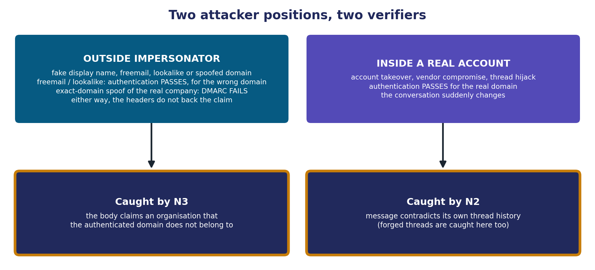
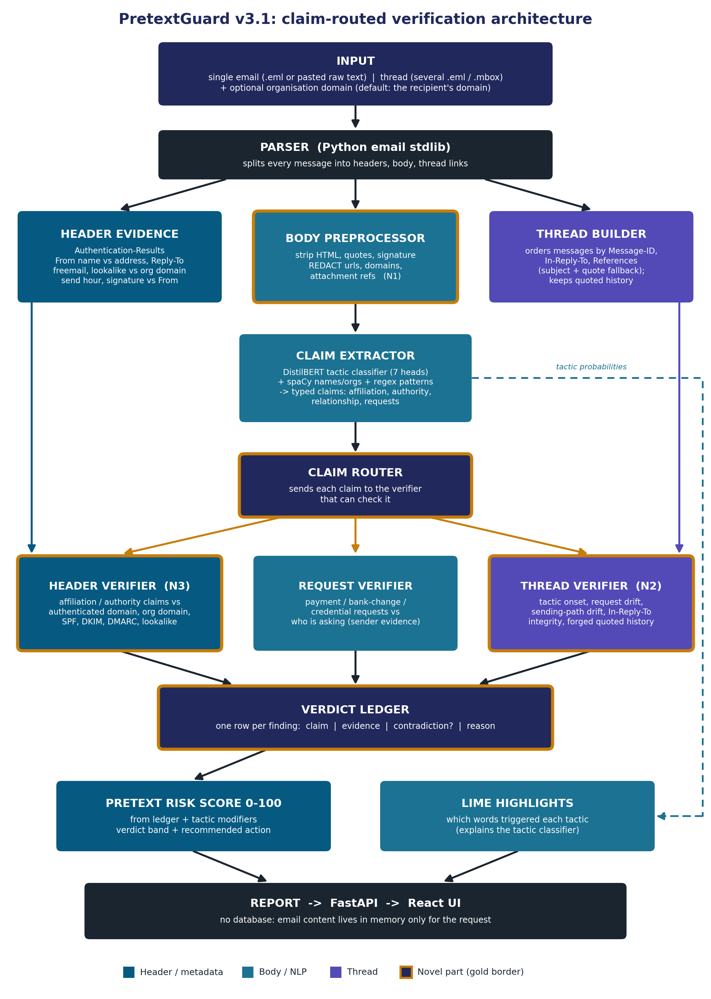
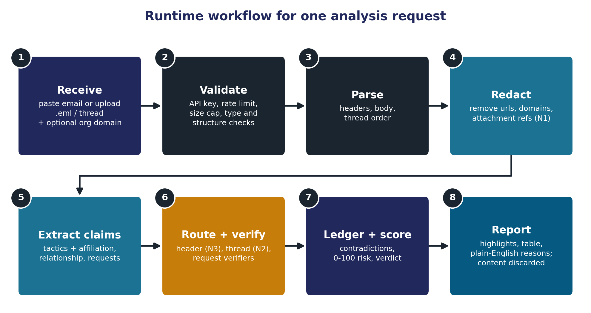
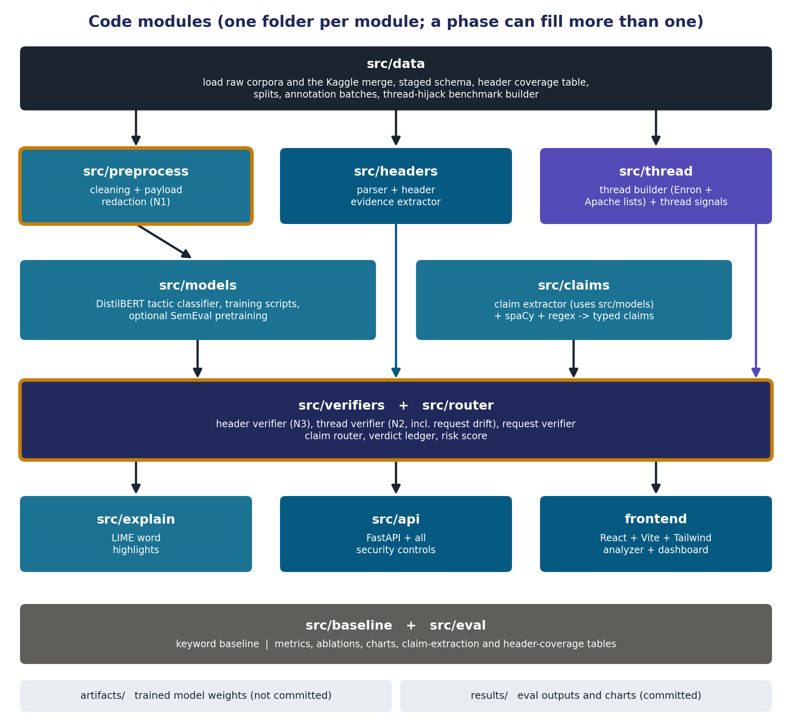
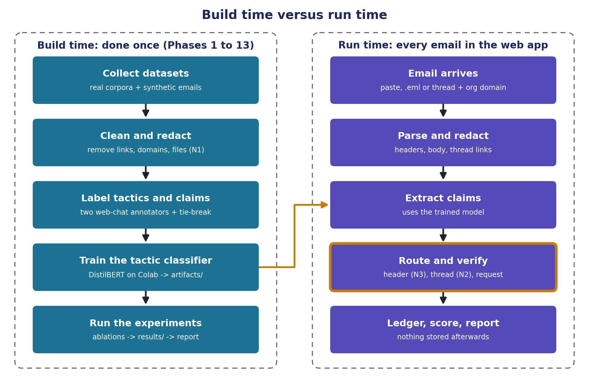

<!-- Living master document (Markdown). docs/PretextGuard_Master_Document_v3.2.docx is a snapshot of version 3.2; export a fresh .docx with pandoc when needed (docs/README.md). -->

**PretextGuard**

Project Master Document

*Payload-free pretexting detection through claim verification*

**Problem statement:** No. 37, Pretexting Pattern Classifier from Email Metadata

**Course:** BCSE410L Cyber Security, VIT Vellore

**Student:** Marupaka Naga Sai Dattu (Nagasai), Reg. No. 23BCE0757

**Faculty:** Dr. Arun Prasath G

**Version:** 3.5, 7 October 2026

> **This is the single source of truth for the project.** Version 3.5 supersedes version 3.4 and every earlier version, PretextGuard_Project_Plan_v2.md, the novelty and architecture slides in both Review-I decks, and every earlier plan discussed in chat. If anything else disagrees with this document, this document wins.

**Contents**

1\. How to use this document

2\. Project snapshot

3\. Problem and threat model

4\. Novelty (final, locked 21 September 2026)

5\. Prior work and how PretextGuard differs

6\. System architecture

7\. Tactic taxonomy

8\. Data plan

9\. Technology stack

10\. Security design

11\. Evaluation plan

12\. Build plan

13\. Viva preparation

14\. Decisions log

15\. Open items and next actions

16\. Glossary

17\. References

# 1. How to use this document

This document is written so that a person or an AI assistant can pick up PretextGuard with no other context: what the project is, what is novel, how it is built, what data it uses, what has been decided, and what happens next.

## 1.1 Rules for anyone picking this up

- **This document wins conflicts.** Stale sources: PretextGuard_Project_Plan_v2.md (still lists SemEval transfer and the severity model as novelty claims; both were struck), the 16-slide and 11-slide Review-I decks (old novelty lineup), and older chat plans.

- **Suggested read order for a new assistant:** docs/PretextGuard_Context.md first (working agreement, environment, current state and the exact next task), then Section 2 (snapshot), Section 4 (novelty), Section 6 (architecture), Section 12 (build plan) and Section 15 (open items). A new chat has no memory of earlier chats; these two documents are all it needs.

- **Section 4.7 lists dead ideas.** Do not propose them again as novelty.

- **Keep it current.** When a decision changes, update the relevant section, bump the version number, and add a row to the decisions log (Section 14).

- **The project-files copy may be text only.** The claude.ai project can store this document as extracted text, so the figures do not come through. Every figure therefore has a text description directly below its caption.

## 1.2 Working agreement

- **Claude writes all the code and all the explanations, one phase at a time.** Nagasai places the files with the commands Claude provides, runs them in VS Code, and reports results or errors back. Claude never runs Git itself; Nagasai commits and pushes.

- **Every file and every function gets a plain-language explanation** before moving on, including the background theory. The rubric deducts 20 marks if the student cannot explain his own implementation.

- **No code copied from GitHub repositories** (30-mark penalty). Use well-known libraries; write the project logic fresh.

- **Assume little background** outside the MERN stack and basic ML/NLP. Explain Python tooling, FastAPI, DistilBERT and similar from the ground up.

- **Prefer the easiest path that still scores well.** Established libraries over custom implementations.

- **Plan first.** Before any large deliverable, share a short plan and wait for Nagasai's go-ahead.

- **Style for anything delivered to Nagasai:** direct and honest, no em dashes, no filler words such as "showcase" or "testament". Documents as .docx or PDF, not HTML.

- **Commit after each working step, not once per phase.** Small, frequent commits to the GitHub repo are the evidence of original, incremental work; one large commit per phase looks like a paste.

- **Two or three steps per phase.** Each phase is folded into a few larger steps; each step delivers several files at once, followed by one run, one check and one commit (Nagasai found Phase 1's five steps too long).

- **File workflow on macOS.** The project lives at ~/Desktop/pretextguard (iCloud Desktop sync is off). Files arrive as downloads in ~/Downloads whenever the interface can attach files (Nagasai's preference), with one block of mv commands per step that puts each file in its exact place; only when the interface cannot hand over files do they arrive as paste blocks that create each file in place (cat \> path \<\< 'PG_EOF' ... PG_EOF, preceded by setopt NO_BANG_HIST) when the interface cannot hand over files. Dotfiles and small config files are created in the terminal, and files that share a name (such as \_\_init\_\_.py) are created with touch, so no two downloads collide.

- **Change list at the end of every phase.** Claude lists what changed so this document can be kept current.

- **No unit tests per phase.** Each phase is verified by running its scripts and checking their printed output; tests/test_environment.py is the one setup check.

- **Fresh chats.** Any new chat, including Claude Code on the web, starts from docs/PretextGuard_Context.md and this document. Nothing carries over from earlier chats, so both files must stay current.

- **Harvest security marks.** When a design choice also improves security (for example, no database), say so explicitly.

# 2. Project snapshot

<table>
<colgroup>
<col style="width: 23%" />
<col style="width: 76%" />
</colgroup>
<thead>
<tr class="header">
<th><strong>Item</strong></th>
<th><strong>Details</strong></th>
</tr>
</thead>
<tbody>
<tr class="odd">
<td>Project name</td>
<td>PretextGuard</td>
</tr>
<tr class="even">
<td>Course</td>
<td>BCSE410L Cyber Security, VIT Vellore (final-year B.Tech CSE)</td>
</tr>
<tr class="odd">
<td>Problem statement</td>
<td>No. 37: Pretexting Pattern Classifier from Email Metadata (picked from a faculty list of 60)</td>
</tr>
<tr class="even">
<td>Type</td>
<td>Individual project. The student must present and explain the work independently.</td>
</tr>
<tr class="odd">
<td>One-line pitch</td>
<td>Pretexting emails carry no link or attachment, so scanners miss them. PretextGuard extracts what an email claims about itself and verifies each claim against the email's headers and its own conversation history. A claim that the evidence contradicts is the detection.</td>
</tr>
<tr class="even">
<td>What gets built</td>
<td>A web app: paste a raw email, or upload a .eml file or a whole thread, optionally give the organisation's domain, and get a 0-100 Pretext Risk Score, highlighted manipulation phrases, a findings table, and plain-English contradictions.</td>
</tr>
<tr class="odd">
<td>Novelty (locked 21 Sep 2026)</td>
<td><p>N1 payload-free evaluation protocol</p>
<p>N2 thread consistency verification</p>
<p>N3 claim-evidence contradiction engine (core)</p>
<p>Architecture contribution: claim-routed verification pipeline</p></td>
</tr>
<tr class="even">
<td>Current status</td>
<td>Phases 0 to 3 complete. Phase 1 built the staged table of 99,324 unique emails from nine sources (20,313 attacks), the header coverage table and a fixed 70/15/15 split. Phase 2 added clean and payload-free (N1) redacted bodies, with no detectable link or address left after redaction and 4,580 naturally link-free attacks. Phase 3 turned every email's headers into evidence for N3: authentication verdicts read only from trusted headers, freemail and lookalike checks, mailing-list and organisation-domain handling. Phase 4 (keyword baseline) is next.</td>
</tr>
<tr class="odd">
<td>Repository</td>
<td>github.com/Nagasai-Datta/PretextGuard (public); local folder ~/Desktop/pretextguard</td>
</tr>
<tr class="even">
<td>Next deadline</td>
<td>Not a planning constraint. Scope is fixed and will not be cut (decision, 22 Sep 2026).</td>
</tr>
</tbody>
</table>

## 2.1 Grading rubric (100 marks)

| **Criterion** | **Marks** | **Where PretextGuard earns it** |
|---|---|---|
| Novelty and innovation | 30 | N1, N2, N3 and the claim-routed architecture (Section 4) |
| Implementation quality | 25 | End-to-end pipeline, model, verifiers, API, UI (Sections 6, 12) |
| Security features | 15 | Sixteen controls mapped to OWASP (Section 10) |
| Literature survey | 10 | Twelve works, closest competitors cited first (Section 5) |
| System design | 10 | Claim-routed architecture, no-persistence design (Section 6) |
| Testing and performance | 5 | One ablation per claim, claim-extraction accuracy, robustness tests (Section 11) |
| Presentation and viva | 5 | Live demo and prepared answers (Section 13) |

**Penalties:** minus 30 for copied or unoriginal work (for example GitHub code); minus 20 for being unable to explain the implementation; minus 20 for fake or manipulated experimental results.

> **Faculty rule on novelty:** merely changing the user interface, programming language, framework, or database does not count as innovation. Stack choices are argued under System Design and Security Features, never under Novelty.

## 2.2 Review-I (completed)

Review-I ran from 29 July 2026: 20 marks, about 10 minutes per student, no code required. Marks: problem understanding 4, literature and existing work 4, novelty and research gap 6, proposed solution 4, planning 2. Delivered: a 16-slide deck with speaker notes, a prep-notes file, and a slide spec for AI design tools. Nagasai also presented his own edited 11-slide deck (review_1.pptx), with the annotated-email diagram on slide 7.

**Outcome:** the faculty struck the old N2 (SemEval cross-domain label transfer) and the old N4 (tactic-stacking severity model) and asked for at least one more core claim. N1 and N3 survived. Section 4 is the response.

# 3. Problem and threat model

## 3.1 What pretexting is

Pretexting is social engineering built on a made-up identity or scenario. The attacker pretends to be someone trusted ("this is the CFO", "this is your vendor") and the story itself is the attack. The victim does the damage personally: wires the money, changes the bank details, shares the data. Business Email Compromise (BEC) is pretexting aimed at company money.

Running example used throughout the project:

```
From: "David Chen - Finance Director" <d.chen.finance@gmail.com>
Reply-To: finance.dept.acme@protonmail.com
Date: Tue, 14 Jul 2026 02:47 AM
Authentication-Results: spf=pass dkim=pass dmarc=pass (all for gmail.com)

Hi Priya, this is David from Finance. I need you to process a wire
transfer before 3 PM today. I'm in meetings all day and can't take
calls. Please don't loop in anyone else - just get it done.
```

Priya works at acmecorp.com. The real David is her company's Finance Director. Note the authentication line: the attacker sent from a real Gmail account, so SPF, DKIM and DMARC all pass. They prove the message came from gmail.com. They say nothing about whether the sender is David from Acme. Catching that gap is N3's job.

## 3.2 Payload versus payload-free

A **payload** is the part of an email that does technical damage: a malicious link or attachment. Email security scanners are built around payloads: URL blacklists, link sandboxes, attachment detonation. A **payload-free** email has no link and no attachment, so those scanners find nothing. The example above has no link, no attachment, no malware and no typos. The entire attack is three phrases: authority ("this is David from Finance"), urgency ("before 3 PM today") and secrecy ("don't loop in anyone else").

## 3.3 Two attacker positions



*Figure 1. Which verifier catches which attacker*

*Text description: two columns. Left: the outside impersonator uses a fake display name and a freemail, lookalike or spoofed domain. Freemail and lookalike senders pass authentication, but for the wrong domain; an exact-domain spoof of the real company fails DMARC. Either way the headers do not back the claim, and N3 catches it because the body claims an organisation that the authenticated domain does not belong to. Right: the attacker inside a real account (account takeover, vendor compromise, thread hijack) passes authentication for the real domain, but the conversation suddenly changes; N2 catches it because the message contradicts its own thread history, and forged threads are caught there too.*

- **Outside impersonator:** fake display name, freemail account, lookalike domain, Reply-To redirection, or a spoof of the company's exact domain. A freemail or lookalike sender usually passes SPF, DKIM and DMARC for its own domain, so the giveaway is that the authenticated domain does not match the organisation the body claims. An exact-domain spoof fails DMARC when the real company publishes a DMARC policy. Either way the headers do not back the claim. **Caught by N3.**

- **Inside a real account:** account takeover, vendor email compromise, thread hijacking (the Emotet and Qakbot reply-chain style). Mail comes from the real account, so SPF, DKIM and DMARC pass and N3 has nothing to contradict. What changes is the conversation: new urgency, new bank details, a different sending path. **Caught by N2.**

- **Forged thread:** the attacker invents a quoted "previous conversation" that never happened. N2's thread-integrity check catches it, and N3 often fires too because the sender is external.

## 3.4 Why it matters

| **Figure** | **Source** | **Status** |
|---|---|---|
| 21,489 BEC complaints; about \$2.9 billion adjusted losses (2023) | FBI IC3 2023 report | Used in Review-I |
| About \$2.77 billion BEC losses (2024) | FBI IC3 2024, as reported by Abnormal AI | Check the primary IC3 report before citing |
| Pretexting volume more than doubled across recent reporting cycles | Verizon DBIR | Used in Review-I |
| 2026 DBIR classifies thread-based attackers building trust as pretexting | Verizon DBIR 2026, as quoted by IRONSCALES | Check the primary DBIR before citing |
| Under 8% of BEC incidents are found by technical controls | Industry reporting (earlier plan) | Source must be re-verified before the report |

## 3.5 Target users and deployment

Corporate email security teams, secure email gateway vendors, and finance or accounts-payable staff (the people BEC targets). Realistic deployment: an extra check at the mail gateway, or an analyst triage tool that explains why a message is suspicious.

## 3.6 Email and authentication basics (for beginners)

An email is a plain text file: headers (the envelope: who sent it, to whom, how it travelled), a blank line, then the body (the letter). The From line has a display name, which is free text anyone can type, and an address whose part after @ is the domain. Most mail apps show only the display name, which is exactly what pretexting exploits.

| Header | What it is | Analogy |
|---|---|---|
| From | Display name and address shown to the reader | The name printed on the letter |
| Reply-To | Where replies actually go, if different from From | "Please reply to this other address" |
| Return-Path | Where bounces go; the true envelope sender | The return address on the envelope |
| Received | One line added by every mail server on the way | Postmarks from each post office |
| Authentication-Results | The receiving server's SPF, DKIM and DMARC verdicts | The post office's inspection stamp |
| Message-ID | Unique ID of this email | A tracking number |
| In-Reply-To, References | IDs of the earlier emails in the conversation | "Re: your letter no. 123" |

**SPF:** the domain publishes the list of mail servers allowed to send for it, and the receiver checks the sending server against that list. **DKIM:** the sending server signs the message with a private key whose public half the domain publishes; a valid signature proves the domain signed it and nobody altered it. **DMARC:** passes when SPF or DKIM passed for a domain that matches the visible From domain, and tells receivers what to do on failure. The receiving server writes all three verdicts into Authentication-Results; PretextGuard reads them.

**The key idea:** authentication proves which domain sent an email, not who the person is. A real Gmail account passes all three checks, so an email claiming to be Acme's Finance Director that authenticates as gmail.com passed authentication for the wrong domain. Spotting that mismatch is N3's job.

# 4. Novelty (final, locked 21 September 2026)

## 4.1 Summary

| **ID** | **Name** | **What it does** | **How we prove it** |
|---|---|---|---|
| N1 | Payload-free evaluation protocol | Removes URLs, domains and attachment file names from email bodies before any model sees them. | Ablation on binary attack-vs-benign detection: model A (raw bodies) vs model B (redacted bodies), each tested on the raw, redacted and naturally link-free views of the same held-out set. A's drop from raw to redacted measures how much prior accuracy was link-reading. |
| N2 | Thread consistency verification | Checks a message against its own thread history (tactic onset, request drift, sending-path drift, thread integrity) and points to the message where the thread flipped. | Detection with vs without the thread verifier on the thread-hijack benchmark, plus hijack-point localisation accuracy. Content signals on real Enron threads, header signals on real Apache mailing-list threads. |
| N3 (core) | Claim-evidence contradiction engine | Checks affiliation, identity and authority claims in the body against what the headers can prove. The header check is conditioned on the claim. | Full system vs text-only vs headers-only vs parallel score fusion (BEC-Guard style). Real positives from affiliation claims in Nazario and Nigerian Fraud; colleague impersonation from synthetic BEC, reported separately. |
| Architecture | Claim-routed verification pipeline | Claims are typed and routed to the verifier that can check them. Output is a ledger of claim, evidence and contradiction. | Same signals wired as a flat classifier vs claim-routed: accuracy, false positives, share of findings with a traceable reason. |

> **Viva line:** "N3 catches the impersonator. N2 catches the attacker who does not need to impersonate, because he is already inside the account." Design principle: PretextGuard never trusts what an email says about itself, and authentication proves which domain sent a message, not who the person is.

## 4.2 N1: payload-free evaluation protocol

**What:** before training or inference, the body is redacted. URLs become \[URL\], email addresses become \[EMAIL\], attachment file names become \[FILE\], bare domains become \[DOMAIN\] (Section 8.10). Words such as "see attached" stay, because they are language, not payload.

**Why:** machine learning models take the cheapest shortcut to a correct answer. In phishing datasets, a suspicious link predicts the label, so a model can reach 97 to 99% by reading links instead of manipulation. Real pretexting has no link, so the shortcut does not exist in the real attack.

**Experiment:** the task is binary attack-vs-benign detection, because the shortcut claim is about phishing detectors. Train model A on raw bodies (prior-work style) and model B on redacted bodies, both DistilBERT; a TF-IDF plus logistic regression pair is a cheap second check. Test both on three views of the same held-out set: raw, redacted, and the naturally link-free subset (emails that had no URL before redaction). Phase 2 measured the test split: 696 attacks and 5,880 benign emails are naturally link-free (results/preprocess_checks.csv). The hypothesis is that A drops sharply from raw to redacted and B holds. Report the measured numbers whatever they are.

## 4.3 N2: thread consistency verification

**What:** when an email arrives inside a thread, it is compared with the earlier messages in that same thread. A legitimate thread changes gradually; a hijacked one flips at one message.

| **Signal** | **What is compared** | **Attack example** |
|---|---|---|
| Tactic onset | Tactic probabilities of the new message vs the average of earlier messages in the thread | Three weeks of calm invoice emails, then urgency and secrecy appear |
| Request drift | Payment details, account numbers and credential requests vs everything earlier in the thread | "We changed banks, please use this new account" |
| Sending-path drift | First Received hop, mail client (X-Mailer), sender domain vs the same sender's earlier messages | Same address but a different origin server and client; or a lookalike domain swapped in mid-thread |
| Thread integrity | In-Reply-To and References must point to real earlier Message-IDs; quoted history must match the real earlier text | A fabricated "previous conversation" with no matching Message-IDs |
| Style drift (optional, dropped first) | Greeting, sign-off and function-word profile vs the sender's earlier messages | The reply is suddenly written in a different voice |

**Output:** the index of the message where the thread flipped, and the signals that fired.

**Input modes:** thread mode needs the earlier messages (several .eml files or one .mbox). In single-email mode N2's history checks are skipped, but In-Reply-To and quoted-text integrity checks still run when that data is present.

**Evaluation data:** raw Enron has no In-Reply-To, References, Received or X-Mailer headers (0% of 517,401 messages, Phase 1 header coverage table), so its threads can only test the content signals (tactic onset, request drift). The header signals (sending-path drift, thread integrity) are tested on public Apache project mailing-list archives, which keep those headers. Both are real threads, and the report states the split.

**Why it is novel:** academic detectors classify single emails. The closest work on compromised accounts (Ho et al., USENIX Security 2019) is URL-based and needs organisation-wide mailbox data. Conversation-level social-engineering detection exists for chat (ConvoSentinel) but uses no email headers. Commercial tools (Abnormal AI, IRONSCALES) do behavioural thread analysis but are closed and depend on login telemetry. An open, explainable, payload-free detector that works at email-thread level with thread headers was not found.

## 4.4 N3: claim-evidence contradiction engine (core)

**What:** the body makes claims; the headers provide evidence. N3 checks each affiliation, identity or authority claim against the evidence that could confirm or contradict it. An affiliation claim is any statement that the sender represents an organisation: the recipient's own company (internal) or an outside one such as a bank, a vendor or a government office (external).

| **Claim in the body** | **Example** | **Evidence checked** | **Contradiction when** |
|---|---|---|---|
| Internal affiliation | "This is David from Finance"; signature says Acme | Authenticated From domain vs organisation domain; SPF, DKIM, DMARC; freemail list; lookalike distance | Claims to be internal but the authenticated domain is external, freemail or a lookalike; or the From shows the organisation's own domain but DMARC fails (exact-domain spoof) |
| External affiliation | "Director of Foreign Operations, Central Bank"; "PayPal Security Team" | Claimed organisation name vs sending domain (rapidfuzz); a small list of known brand domains; authentication | The sending domain does not belong to the claimed organisation |
| Authority or rank | "As CFO I need this today" | Display name vs address; lookalike distance to organisation domains | Rank claimed from a freemail, lookalike or unauthenticated sender |
| Reply direction | "Reply to me directly" | Reply-To vs From | Reply-To points to a different domain |
| Contact details in signature | Signature email or phone | Signature email vs From address | The signature address differs from the sending address |
| Prior relationship | "As we discussed on the call" | Handed to the thread verifier (N2) | No such conversation exists |

**Tactics without verifiers:** urgency, secrecy, scarcity, reciprocity, social proof and liking cannot be proven or disproven by headers. They act as modifiers: they raise the weight of any contradiction that is found.

**Conditioning, in two examples:** spf=fail on a newsletter is low risk. spf=fail on a message claiming to be the CFO and ordering a payment is high risk. The reverse also holds: dmarc=pass on a Gmail message is normal, but dmarc=pass on a Gmail message claiming to be Acme's Finance Director is a contradiction, because authentication passed for the wrong domain. Same header values, different meaning, and the only thing that changed is the claim. BEC-Guard runs a header classifier and a body classifier in parallel and combines their scores. Adding two scores cannot express "the body claims X and the headers disprove X", because the scores do not know they are about the same claim.

**Organisation domain:** internal-affiliation checks need the organisation's own domain(s). The UI and API take them as an optional field that defaults to the recipient's domain from the To header; datasets use the To domain. When it is missing or anonymised, internal-affiliation checks are recorded as not checkable instead of guessed. Phase 3 also treats collector mailboxes, placeholder domains and free mailboxes in To as giving no organisation domain (Section 8.11). External-affiliation checks do not need it.

## 4.5 Architecture contribution: claim-routed verification pipeline

Most detectors, including the old v1 plan, work as email to features to classifier to score, with an explanation added afterwards. PretextGuard works like a fact-checking pipeline (claim detection, evidence retrieval, verdict), applied to email, where the evidence is protocol metadata and conversation history instead of documents.

1.  **Claim-first evidence.** The body decides which evidence gets checked. Evidence is gathered per claim, not all at once and blended. This is the general form of N3's conditioning.

2.  **Explanation by construction.** The output is the reason: "claims to be Acme Finance; authenticates only as gmail.com". LIME is reduced to one job, highlighting which words triggered each tactic.

3.  **Extensible.** A new attack pattern means adding one verifier function. The NLP model does not need retraining.

| **Architecture style** | **Example** | **Weakness** |
|---|---|---|
| End-to-end classifier | Two-Stage Framework (MDPI Computers, 2025) | Score first, explanation bolted on afterwards |
| Parallel fusion | BEC-Guard (USENIX Security 2019) | Two scores added; a claim cannot be linked to the evidence against it |
| Claim annotation only | Mithun et al. (2024) | Marks claims but leaves verification to a future algorithm |
| Claim-routed verification | PretextGuard | (this project) |

It is presented on the architecture slide as the system design the three claims live inside, not as a fourth numbered claim, so it cannot be dismissed as padding.

## 4.6 Plain components (kept, not claimed as novelty)

- **Pretext Risk Score 0-100:** the old N4 idea, kept as the output the UI needs.

- **SemEval-2023 Task 3 pretraining:** the old N2 idea, optional; run only if time allows.

- **Isolation/Secrecy as a seventh tactic** (not a Cialdini principle; see Section 7): a design choice worth mentioning in the report, not a numbered claim.

- **LIME word highlights** and the **keyword baseline**.

## 4.7 Dead ideas: do not propose again

| **Idea** | **Status** | **Why** |
|---|---|---|
| v1: DistilBERT on LLM-generated emails labelled with Cialdini principles | Scrapped, July 2026 | Near-duplicate of the Two-Stage Framework paper (MDPI Computers 14(12):523, 2025) |
| Old N2: SemEval-2023 cross-domain label transfer as novelty | Struck by faculty after Review-I | Kept only as optional pretraining |
| Old N4: tactic-stacking severity model as novelty | Struck by faculty after Review-I | Kept only as the plain 0-100 score |
| Stack choices as novelty (FastAPI, React, no database) | Never valid | Excluded by the faculty rule |
| "Dual-reference verification" as a separate numbered claim | Merged | Became the architecture contribution |
| Tactic co-occurrence analysis as novelty | Not valid | Already done by Pan et al. (2026) and Ferreira and Teles (PPSE) |

# 5. Prior work and how PretextGuard differs

> **Gap statement:** existing persuasion-based detectors score single emails that usually carry payloads, and none verifies what an email claims against its own metadata or conversation history. The attacks that most need this, payload-free pretexting from spoofed senders and from hijacked accounts, are exactly the ones they do not isolate.

| **Work** | **What it does** | **Where PretextGuard differs** |
|---|---|---|
| Karki, Abri, Siami Namin, Jones (2022). IEEE Big Data, pp. 2841-2848 | BERT, RoBERTa and DistilBERT classify Cialdini principles in phishing emails | Payload-bearing phishing, body only; no metadata, no verification |
| Two-Stage Deep Learning Framework (2025). MDPI Computers 14(12):523 | 2,995 GPT-generated phishing emails labelled with Cialdini principles; DistilBERT then a dense network | Emails and labels both LLM-made; payload-bearing; body only. Closest competitor to the old v1 |
| Pan, Yang, Cole, Wilson, Woodard (2026). Expert Systems with Applications | 340,912 emails annotated by 4 LLMs under 3 prompting strategies; persuasion cue interactions | Analysis study, not a detector; no header or thread verification. Our precedent for LLM-assisted annotation |
| Valecha, Mandaokar, Rao (2022). IEEE TDSC 19(2):747-756 | Phishing email detection using persuasion cues | Content cues only; no claim verification against metadata |
| Aggarwal, Kumar, Sudarsan (2014). SIN '14, ACM, pp. 217-222 | Detects link-free phishing that baits the victim into replying with sensitive data, using content features such as no recipient name, a money offer and a reply prompt | Scores scam content only; does not check who the sender claims to be against headers or thread history; no colleague impersonation or hijacked threads. Closest prior work on the payload-free angle |
| Mithun, Bartlett, Mirkovic, Freedman (2024). arXiv:2405.12494 (USC ISI) | 940 emails annotated with 32 weak explainable phishing indicators, including sender affiliation claims; argues mismatches are stronger signals than content | Annotates claims but explicitly leaves verification to a future downstream algorithm and does not propose a detector. PretextGuard builds that verifier. Must be cited. |
| Cidon et al. (2019). BEC-Guard, USENIX Security | Header classifier and body classifier in parallel, scores combined | Additive fusion; no claim-conditioned checks; no thread consistency |
| Ho et al. (2019). Detecting and Characterizing Lateral Phishing at Scale, USENIX Security | Phishing sent from compromised enterprise accounts; 113M emails, 92 organisations | URL-based only and needs organisation-wide mailbox data; the authors state it misses narrow, stealthy content-level attacks |
| Ai et al. (2024). ConvoSentinel, arXiv:2406.12263 | Message-level and conversation-level social-engineering detection | Chat, not email; no header or thread-integrity evidence |
| Piskorski et al. (2023). SemEval-2023 Task 3 | 23 persuasion techniques, human span annotation, news | News domain; used only as optional pretraining data |
| Al-Subaiey et al. (2024). Computers and Electrical Engineering 120:109625 | Web platform on about 82.5k merged emails, interpretable phishing detection | Binary phishing vs legitimate; no tactics, no claim verification. Source of our merged corpus |
| Commercial tools (Abnormal AI, IRONSCALES, Darktrace) | Behavioural AI for thread hijacking and account takeover | Closed methods relying on login and device telemetry; not inspectable or reproducible |

**Background references for the report:** Cialdini, Influence (taxonomy); Stajano and Wilson (2011), principles of scam victims (source of the urgency tactic); Ferreira and Teles, PPSE framework; Lumen (2021), influence cues in text; Da San Martino et al. (2019), propaganda technique taxonomy; Stringhini and Thonnard (2015), IdentityMailer; Duman et al. (2016), EmailProfiler; SoK re-examination of phishing research (dataset quality).

# 6. System architecture

## 6.1 Architecture diagram



*Figure 2. Claim-routed verification architecture (gold border = novel part)*

*Text description: input (single email, thread, optional organisation domain) goes to the parser, which feeds three branches: header evidence, the body preprocessor (N1 redaction) and the thread builder. The claim extractor reads the redacted body and produces typed claims (affiliation, authority, relationship, requests) plus tactic probabilities. The claim router sends each claim to the header verifier (N3), the request verifier or the thread verifier (N2); header evidence feeds the header verifier and the thread builder feeds the thread verifier. All verifiers write rows to the verdict ledger, which drives the 0-100 risk score. LIME highlights explain the tactic classifier. Both outputs form the report returned through FastAPI to the React UI, with no database. Gold borders mark the novel parts: body preprocessor, claim router, both verifiers and the ledger.*

## 6.2 Components

| **Component** | **Input** | **Output** | **Implementation** | **Module** |
|---|---|---|---|---|
| Parser | Raw .eml bytes, pasted text, or a thread | Headers, body, thread links | Python email stdlib with its default legacy parser (the most forgiving with malformed spam headers), each header field parsed on its own; a fallback for From values the strict address parser rejects; mailbox for .mbox files (Section 8.11) | src/headers |
| Header evidence extractor | Headers + organisation domain(s) | Evidence dict: SPF, DKIM and DMARC verdicts (or unknown) from trusted Authentication-Results headers, the authenticated domain and its alignment with From, From name/address/domain, Reply-To divergence, envelope mismatch, Received hops and origin IP, send hour, freemail and open-platform flag, name-shows-address flag, list mail, lookalike score vs the organisation domain (vs claimed domains in Phase 8, same function) | email.utils, tldextract (offline), rapidfuzz, hand-written freemail list (Section 8.11) | src/headers |
| Body preprocessor | Body | Clean text (links kept), redacted text (N1), signature | BeautifulSoup HTML to text; list footer and quoted history removed; ReDoS-safe regular expressions; tldextract with its offline public suffix list (Section 8.10) | src/preprocess |
| Thread builder | Several messages | Ordered thread, per-message evidence, quoted history | Message-ID, In-Reply-To, References; fallback for Enron: normalised subject, participants and quote matching | src/thread |
| Claim extractor | Redacted body and signature block | Typed claims (affiliation_internal, affiliation_external, authority, relationship, request types) with text span, claimed organisation and confidence | DistilBERT 7-head tactic classifier + spaCy NER + regex patterns | src/claims |
| Claim router | Claims | Claim-to-verifier assignments | Rule table (Section 6.4) | src/router |
| Header verifier (N3) | Affiliation, authority, reply and signature claims + header evidence + organisation domain | Ledger rows | Python rules with weights | src/verifiers |
| Thread verifier (N2) | Relationship and request claims + thread | Ledger rows + hijack index | Tactic deltas, request drift (set differences on payment details), sending-path comparison, Message-ID and quote matching | src/verifiers |
| Request verifier | Request claims + sender evidence | Ledger rows | Regex for account numbers and IBANs, keyword patterns; checks who is asking. Request drift against the thread belongs to the thread verifier (N2) | src/verifiers |
| Ledger + risk score | Ledger rows + tactic probabilities | Score 0-100, verdict band, recommended action | Weighted formula calibrated on validation data | src/router |
| LIME highlights | Body + classifier | Word weights per tactic | lime library | src/explain |
| API | HTTP request (email or thread, optional organisation domain) | JSON report | FastAPI, Pydantic, slowapi | src/api |
| UI | JSON report | Analyzer page and evaluation dashboard | React + Vite + Tailwind | frontend |

## 6.3 Data contracts

Claim object produced by the claim extractor:

```
{
  "claim_id": "c1",
  "type": "affiliation_internal",
  "text": "this is David from Finance",
  "span": [10, 36],
  "attributes": {"person": "David", "organisation": "Acme", "department": "Finance"},
  "confidence": 0.91
}
```

Ledger row produced by a verifier:

```
{
  "claim_id": "c1",
  "verifier": "header",
  "evidence": {"from_domain": "gmail.com", "org_domain": "acmecorp.com", "freemail": true,
               "spf": "pass", "dkim": "pass", "dmarc": "pass"},
  "contradiction": true,
  "severity": "high",
  "reason": "Claims to be internal Acme Finance, but the message authenticates as gmail.com, an external freemail domain."
}
```

Report returned by the API (shape): score, verdict, action, org_domain (as used, or null), tactics (name, probability, highlighted spans), ledger (rows as above, including checks marked not checkable), header_findings, thread (hijack index and signals, or null), request_id. Email content is never stored after the response.

## 6.4 Routing table

| **Claim type** | **Routed to** | **Notes** |
|---|---|---|
| affiliation_internal, affiliation_external, authority | Header verifier | Core N3 checks; internal checks need the organisation domain |
| reply_direction, signature_contact | Header verifier | Reply-To and signature vs From |
| prior_relationship | Thread verifier | Does the claimed conversation exist? |
| payment_request, payment_change, credential_request, gift_card, data_request | Request verifier; plus thread verifier when a thread is present | The request verifier checks who is asking; the thread verifier checks request drift against earlier messages (N2) |
| urgency, secrecy, scarcity, reciprocity, social_proof, liking | No verifier | Modifiers that raise the weight of contradictions |

## 6.5 Header signals

| **Signal** | **Comes from** | **Normal** | **Attack** | **Meaning** |
|---|---|---|---|---|
| SPF | Authentication-Results | pass | fail on an exact-domain spoof; pass for freemail or lookalike senders | Did it come from a server the domain allows? Pass proves the domain, not the person |
| DKIM | Authentication-Results | pass | none / fail on a spoof; pass for freemail or lookalike senders | Is there a valid signature proving it was not forged? |
| DMARC | Authentication-Results | pass | fail on an exact-domain spoof; pass for freemail or lookalike senders | Final verdict aligning SPF and DKIM with the visible From domain. It shows which domain sent the message, not whether that domain matches the claim |
| Name vs address | From | Name and domain agree | "Finance Director" \<x@gmail.com\> | The display name is free text anyone can type |
| Freemail | From domain | Company domain | gmail, yahoo, proton; open platforms such as \<tenant\>.onmicrosoft.com | Executives do not send from personal accounts; anyone can get an address there |
| Lookalike distance | From domain vs organisation domains | Exact match | acme-corp.co; paypa1.com; acme-payroll.onmicrosoft.com | Very similar but not equal (rapidfuzz, after punycode decoding and look-alike character mapping) |
| Reply-To divergence | Reply-To vs From | Empty or same | Different domain | Replies are silently routed to the attacker |
| Envelope mismatch | Return-Path, Received | Consistent with From (mailing lists are the exception: they send bounces to the list server) | Unrelated server | The envelope and the letterhead disagree |
| Send-hour anomaly | Date | Business hours | 02:47 | Weak alone; meaningful when stacked |
| Signature vs From | Body signature block | Same address | Different address | Insight from Mithun et al. (2024) |

> PretextGuard reads the SPF, DKIM and DMARC verdicts written by the receiving mail server into the Authentication-Results header. It does not recompute them. When that header is missing (common in old corpora), the signal is recorded as **unknown**, never as pass, and the verifiers rely on the other evidence. Which sources carry which headers is measured in Phase 1 (the header coverage table, Section 8.1), and authentication signals are scored only where the header exists. Phase 1 found Authentication-Results on 99.5% of phishing_pot, about 100% of Apache list mail, 20.4% of raw Nazario and 0% of SpamAssassin, raw Enron and Kaggle rows. **Which Authentication-Results headers are trusted (Phase 3):** an attacker can write a fake one into the email they send, so only headers the receiving organisation added are read: the topmost one (servers add headers at the top), plus the headers directly below it from the same organisation, stopping at the first header from anyone else; a higher header always wins. RFC 8601 (Section 5) requires receivers to delete incoming headers that claim to come from inside their own organisation. Both formats are read: the standard one, which starts with the checking server's name, and Microsoft's, which leaves the name out. **Mailing lists:** every Apache message carries a Reply-To set by the list and a List-Id, so list membership is recorded and a list-set Reply-To is not Reply-To divergence; lists also send bounces to their own server, so envelope mismatch is normal for list mail. Phase 3 results: Section 8.11.

## 6.6 Pretext Risk Score (plain component)

The score is computed from the ledger: each contradiction adds points by severity (affiliation and payment contradictions weigh most), manipulation tactics add smaller points, and urgency or secrecy multiply the weight of contradictions found alongside them. The result is capped at 100. Weights are calibrated on the validation split, never on the test split.

Initial verdict bands, to be tuned in Phase 10: **0-34 Benign**, **35-69 Suspicious**, **70-100 High risk**. Each band maps to a recommended action (for example: verify through a known phone number before acting).

## 6.7 Worked example

```
Claims extracted from the David email
  c1 affiliation_internal  "this is David from Finance"
  c2 payment_request       "process a wire transfer"
  modifiers: urgency ("before 3 PM today"), secrecy ("don't loop in anyone else")

Ledger
  c1 -> header verifier : claims Acme Finance; From gmail.com (freemail),
                          authenticated as gmail.com (spf, dkim, dmarc pass),
                          org acmecorp.com                 -> CONTRADICTION (high)
  c1 -> header verifier : Reply-To protonmail.com != From   -> CONTRADICTION (medium)
  c2 -> request verifier: payment request from an external
                          freemail sender                   -> CONTRADICTION (high)

Score: high-severity contradictions x urgency and secrecy -> High risk band
Action: do not pay; call David on a number from the company directory.
```

**Variant, exact-domain spoof:** if the attacker had instead forged From: "David Chen" \<d.chen@acmecorp.com\> from his own server, the From would look internal, but Acme's DMARC policy would fail the message (dmarc=fail). The header verifier then records: claims internal, uses Acme's own domain, fails Acme's authentication, CONTRADICTION (high). Either way, N3 compares the claim with what authentication actually proved.

## 6.8 Runtime workflow



*Figure 3. Eight steps for one analysis request*

*Text description: eight steps in two rows. 1 Receive (paste an email or upload a .eml or thread, plus an optional organisation domain); 2 Validate (API key, rate limit, size cap, type and structure checks); 3 Parse (headers, body, thread order); 4 Redact (remove URLs, domains and attachment references, N1); 5 Extract claims (tactics plus affiliation, relationship and request claims); 6 Route and verify (header verifier N3, thread verifier N2, request verifier); 7 Ledger and score (contradictions, 0-100 risk, verdict); 8 Report (highlights, findings table, plain-English reasons; the email content is then discarded).*

## 6.9 Module map



*Figure 4. Code modules; a build phase can fill more than one folder*

*Text description: src/data (raw corpora, Kaggle merge, staged schema, header coverage table, splits, annotation batches, thread-hijack benchmark) feeds src/preprocess (cleaning and N1 redaction), src/headers (parser and header evidence) and src/thread (thread builder for Enron and Apache threads, thread signals). src/preprocess feeds src/models (DistilBERT classifier), which src/claims uses. Models, headers, claims and thread all feed src/verifiers plus src/router (header verifier N3, thread verifier N2 including request drift, request verifier, claim router, ledger, risk score). These feed src/explain (LIME), src/api (FastAPI and security controls) and the React frontend. src/baseline and src/eval sit alongside. artifacts/ holds trained weights (not committed); results/ holds evaluation outputs (committed).*

## 6.10 Build time and run time

The project has two halves. Build time happens once, on the Mac and on Colab, during Phases 1 to 13: collect and clean the data, label it, train the tactic classifier and run the experiments. Run time is the web app: it analyses one email at a time and stores nothing. The only thing that crosses from build time to run time is the trained model in artifacts/; the experiment numbers feed the report and the dashboard.



*Figure 5. Build time versus run time*

*Text description: two dashed columns. Left, build time, done once in Phases 1 to 13: collect datasets (real corpora plus synthetic emails), clean and redact (N1), label tactics and claims (two web-chat annotators plus a tie-break), train the tactic classifier (DistilBERT on Colab, saved to artifacts/), run the experiments (ablations to results/ and the report). Right, run time, every email in the web app: email arrives (paste, .eml or thread plus organisation domain), parse and redact, extract claims (using the trained model), route and verify (header N3, thread N2, request; gold border = novel), ledger, score and report, with nothing stored afterwards. A gold arrow carries the trained model from the training step to claim extraction.*

Run-time steps, mapped to the code that performs them:

| Step | What happens | David example | Code lives in |
|---|---|---|---|
| 1\. Receive | The browser sends the email and the optional organisation domain | Raw text of the David email | frontend/, src/api/ |
| 2\. Validate | API key, rate limit, size cap, type and structure checks | Passes | src/api/ |
| 3\. Parse | Headers, body and thread links; headers become an evidence dict | from_domain gmail.com, freemail, dmarc pass, Reply-To protonmail.com | src/headers/, src/thread/ |
| 4\. Redact (N1) | Links, domains and file names become placeholders | No links, body unchanged | src/preprocess/ |
| 5\. Extract claims | Tactic probabilities plus typed claims from patterns and name detection | c1 affiliation_internal, c2 payment_request; urgency 0.94, secrecy 0.91 | src/models/, src/claims/ |
| 6\. Route and verify | Each claim goes to the verifier that can check it | Header and request verifiers both find contradictions | src/router/, src/verifiers/ |
| 7\. Ledger and score | Contradictions add points; urgency and secrecy multiply them | High risk band | src/router/ |
| 8\. Report | JSON back to the browser; the email is discarded from memory | Highlights, findings table, recommended action | src/api/, src/explain/, frontend/ |

**API endpoints (Phase 11):** POST /analyze (one email, optional organisation domain), POST /analyze/thread (several emails), GET /results (evaluation numbers for the dashboard), GET /health.

## 6.11 Machine learning parts in plain words

- **Classifier:** a program that learns patterns from labelled examples. Shown thousands of emails marked with the tactics they use, it learns what each tactic sounds like.

- **DistilBERT and fine-tuning:** DistilBERT is a smaller, faster version of BERT that has already read a huge amount of English. Fine-tuning shows it our labelled emails so it learns the seven tactics on top of what it knows. It outputs seven independent probabilities (multi-label), for example urgency 0.94 and liking 0.03.

- **Weights and Colab:** training needs a GPU, so it runs on Google Colab's free GPU. The result is a set of weight files (the learned numbers), downloaded into artifacts/ and used on the Mac's CPU, which is fast enough for one email at a time.

- **spaCy and regex:** spaCy finds people and organisation names; regex patterns catch phrases such as "this is X from Y", account numbers and signature blocks. The claim extractor combines them with the classifier into typed claims.

- **LIME:** removes words one at a time, watches how a tactic probability changes, and highlights the words that mattered most.

- **Keyword baseline:** fixed word lists per tactic; it exists to show that DistilBERT beats simple rules.

# 7. Tactic taxonomy

Seven labels, multi-label (one email can carry several). Five come from Cialdini's principles: authority, scarcity, reciprocity, social proof and liking. Urgency is not a Cialdini principle; it comes from Stajano and Wilson's time principle (2011), which phishing research treats separately from scarcity. The seventh, isolation/secrecy, comes from the BEC literature.

| **\#** | **Tactic** | **What it looks like** | **Example phrase** |
|---|---|---|---|
| 1 | Authority | Asserted rank, role or institutional power | "This is the CFO"; "IT Security requires" |
| 2 | Urgency | Manufactured deadline or time pressure (Stajano and Wilson's time principle, not Cialdini) | "Before 3 PM today"; "immediately" |
| 3 | Scarcity | Loss or finality framing | "Last chance"; "your account will be deleted" |
| 4 | Reciprocity | Debt framing | "I covered for you last month, now I need..." |
| 5 | Social proof | Everyone else has already done it | "The whole team has already signed off" |
| 6 | Liking / rapport | Manufactured warmth, flattery, false familiarity | "Great seeing you at the offsite, quick favour..." |
| 7 | Isolation / secrecy | Cut the victim off from verification (not in Cialdini) | "Keep this between us"; "don't loop in your manager" |

**Dropped:** commitment/consistency (rare in single emails, hard to annotate, would be a sparse label). **Urgency vs scarcity:** urgency is a deadline or time pressure; scarcity is loss or finality framing. An email can carry both ("reply by 5 PM or the account is deleted"), and then both labels apply. **Why secrecy matters most:** a legitimate business request almost never asks you to avoid verification.

# 8. Data plan

**Principle:** real data first; synthetic data only to fill gaps that are measured and documented.

## 8.1 Datasets

| **Dataset** | **Email?** | **Size (approx.)** | **Fields** | **Role** |
|---|---|---|---|---|
| Phish No More (Kaggle): Enron, Ling, CEAS-08, Nazario, Nigerian Fraud, SpamAssassin | Yes | 82,486 rows in six per-source files (42,891 phishing/spam, 39,595 legitimate), plus phishing_email.csv, a pre-merged copy that is not read | CEAS, Nazario, Nigerian, SpamAssassin: sender, receiver, date, subject, body, urls. Enron, Ling: subject, body | Main single-email corpus for body-level work. Four files are used (CEAS-08, Enron, Ling, Nigerian Fraud: 73,273 emails after deduplication); the Nazario and SpamAssassin files are replaced by the raw corpora (Section 8.8) |
| Enron raw (CMU maildir) | Yes | 517,401 messages | Message-ID (internal JavaMail IDs), Date, From, To, Subject, X-From, X-To, X-Folder; no In-Reply-To, References, Received or X-Mailer (0% each, Phase 1) | Not in the single-email table (the Kaggle merge holds Enron bodies); header check; real threads for N2 content signals (Phase 9) |
| Nigerian Fraud (inside the merge) | Yes | 3,332 rows (3,227 after deduplication) | As above | Real fraud positives (body level) and real external affiliation claims for N3. The merge's Nazario file (1,565 rows, not about 15k as earlier versions said) is not used: the raw Nazario corpus replaces it |
| CEAS-08 (inside the merge) | Yes | 39,154 rows (38,077 after deduplication) | sender, receiver, date, subject, body, urls only; no Reply-To, Received or Authentication-Results | Body-level ham and spam only. The merge's SpamAssassin file (5,809 rows) is not used: the raw SpamAssassin corpus replaces it |
| SpamAssassin public corpus (raw) | Yes | 6,046 messages from five archives (5,775 after deduplication) | Full raw headers (2002 to 2005, before DMARC; 0% Authentication-Results) | Header evidence extractor development; benign and spam headers |
| Nazario phishing corpus (raw mbox files) | Yes | 12,010 messages in 17 files up to 2025 (9,595 after deduplication) | Full raw headers; 20.4% carry Authentication-Results (the newer years) | Real attack positives with headers; external affiliation claims for N3 |
| phishing_pot (GitHub dataset of honeypot .eml files; data only, no code) | Yes | 8,614 files (7,491 after deduplication) | Full raw headers; 99.5% carry Authentication-Results; recipient addresses anonymised. Last public commit 21 May 2026; newer samples go only to individual researchers | Modern attack positives with real authentication headers. Licence CC BY-NC 4.0 (non-commercial use with attribution); never redistributed |
| Apache project mailing-list archives (monthly mbox export) | Yes | users@tomcat.apache.org and users@kafka.apache.org, Oct 2024 to Sep 2026: 3,234 messages (3,190 after deduplication) | Full headers: Message-ID, In-Reply-To (63 to 78%), References, Received, Authentication-Results (about 100%), List-Id; a Reply-To set by the list on every message | Modern legitimate mail with authentication headers (in the single-email table as ham); real threads for N2 header signals (sending-path drift, thread integrity) |
| SemEval-2023 Task 3, Subtask 3 | No (news) | 26,663 paragraphs, 23 techniques | Human span labels, multi-label | Optional pretraining (plain component) |
| Synthetic | Yes | About 500 emails + injected thread replies | Full | Modern BEC gap-fill; thread-hijack injections; matched benign continuations. Generated through free web chats from fixed prompt templates and stored in data/synthetic/ (committed) |

**Header coverage table (Phase 1, results/header_coverage.csv):** for every source, the share of messages carrying Message-ID, Date, Reply-To, Return-Path, Received, Authentication-Results, Received-SPF, DKIM-Signature, In-Reply-To, References, X-Mailer, User-Agent, List-Id and X-Original-From. Key results: Authentication-Results on 99.5% of phishing_pot, about 100% of Apache, 20.4% of Nazario and 0% of SpamAssassin and raw Enron; In-Reply-To on 63 to 78% of Apache, 30.2% of SpamAssassin and 0% of raw Enron; Kaggle rows carry no original headers. The table goes into the report. Authentication signals are scored only where the header exists; synthetic headers fill only the gaps this table shows, and that is disclosed. Modern authentication headers appear mostly on attacks (phishing_pot) and on one benign source (Apache), an imbalance the N3 evaluation must report. Phase 3 sharpened it: Apache's trusted headers carry DKIM verdicts only, so no benign source has SPF or DMARC verdicts (Section 8.11).

## 8.2 Why several datasets

The project needs five things and no single dataset has them all: examples of normal and attack email (Enron; Nazario and Nigerian Fraud), real header evidence (raw SpamAssassin, raw Nazario, phishing_pot; the Kaggle merge keeps only sender and date), tactic and claim labels (none of the email corpora have them; SemEval has human tactic labels but is news), threads for content signals (raw Enron), and threads with full headers for header signals (Apache mailing lists). Each source fills one gap.

## 8.3 Thread-hijack benchmark (for N2)

1.  Rebuild real threads from raw Enron using normalised "RE:" subjects, participants and quoted text, because raw Enron has no In-Reply-To or References (0%, Phase 1 header coverage table). Rebuild Apache mailing-list threads from Message-ID, In-Reply-To and References.

2.  Keep threads with at least three messages.

3.  Pick an injection point and generate an attacker reply in one of three variants: account-takeover reply (same sender, content drift; on Apache threads the sending details are copied from that sender's real messages), mid-thread lookalike domain swap, or forged thread (a new email with fabricated quoted history and no matching Message-IDs).

4.  Negatives: the real next reply from the same thread (Enron or Apache), plus a synthetic benign continuation generated with the same generator and prompt template (style-confound control).

5.  Labels: hijacked or not (thread level) and the hijack message index.

6.  Evaluation split: content signals (tactic onset, request drift) are scored on Enron threads; header signals (sending-path drift, thread integrity) on Apache threads.

7.  Disclose in the report that the injected replies are synthetic while the base threads are real.

## 8.4 Tactic labels and annotation

- **SemEval:** human labels, mapped from 23 techniques to our 7 with a documented mapping table (Phase 5).

- **Synthetic emails:** a script in src/data writes fixed prompt templates; Nagasai pastes them into a free web chat and saves the JSON replies in data/synthetic/. Labels are known from the prompt, and every synthetic attack has a benign twin from the same template.

- **Real attack emails:** a stratified sample of about 600 to 800 is labelled for the seven tactics and for claim types with text spans (affiliation, authority, relationship, request types), so the claim extractor can be evaluated too. Labelling uses the free web chat interfaces of two different model families, Gemini (annotator 1) and DeepSeek (annotator 2); z.ai (GLM) breaks ties where they disagree. No paid APIs. Method follows Pan et al. (2026).

- **Procedure:** a script in src/data writes batch prompt files of about 20 redacted emails with fixed instructions and a fixed JSON output schema. Nagasai pastes each batch into a fresh chat, saves the reply as a JSON file in data/labelled/\<annotator\>/, and records the model name and date. A validation script checks every reply against the schema and lists items to re-ask.

- **Agreement:** Cohen's kappa per label (each tactic and each claim type), reported with the mean. Final labels: agreed labels stand; disagreements take the tie-breaker's label.

- **Limitations to state:** web chats give no temperature control and their models change over time, so labels are not exactly reproducible. Mitigations: one model per annotator for the whole run, fixed prompts, and every raw reply saved in the repo.

- **Decision recorded:** Nagasai chose not to hand-label, including a small human validation sample. Validation therefore rests on agreement between two LLM annotators; the report should state this as a limitation and describe the annotation method as it actually happened.

## 8.5 Style-confound control

If attacks are written by an LLM and legitimate emails are human-written from 2001, a model can learn "LLM vs 2001 human" instead of manipulation. Controls: real attack emails are the primary positives; every synthetic attack has a matched synthetic benign twin from the same generator and template; a source classifier (LLM vs Enron vs Nazario) is trained and its AUC is reported as a threat to validity.

## 8.6 Splits

The single-email table is split 70% train, 15% validation and 15% test in Phase 1 (src/data/split.py), after duplicates are removed. The cut is stratified by source and category. Inside a stratum, emails whose subjects match after removing "Re:"/"Fwd:" prefixes (a thread, or one spam campaign) go to the same split, so near-copies never sit on both sides; a subject shared by more than 2% of its stratum (and more than 25 emails) is too common to be one thread and is split email by email. Group order comes from SHA-256 of seed 42 and the group key, so the split is identical on every machine and library version. Result: 69,542 train, 14,879 validation and 14,903 test (results/split_counts.csv). The test split stays untouched until final evaluation in Phase 13; weights and thresholds are tuned on validation only. The thread benchmark is split by thread in Phase 9, so no thread appears in both training and test.

## 8.7 Unified schema

The schema is filled in stages, so no phase depends on a later one. The phase that fills each group is shown on the right.

```
id, source, category, is_attack, has_full_headers,
raw_ref, raw_headers, body_raw, split                      (Phase 1)
body_clean, body_redacted, has_url, signature              (Phase 2)
from_name, from_addr, from_domain, from_registered_domain,
reply_to, return_path, to_domain, subject, date,
message_id, in_reply_to, references, list_id, mailer,
spf, dkim, dmarc (or unknown), auth_source,
authenticated_domain, auth_aligned, received_hops,
origin_ip, send_hour, freemail, name_has_address,
list_mail, reply_to_divergence, envelope_mismatch,
org_domain, org_checkable, from_matches_org,
org_lookalike_score, parse_problems         (Phase 3, headers.parquet)
tactic_authority, tactic_urgency, tactic_scarcity,
tactic_reciprocity, tactic_social_proof, tactic_liking,
tactic_secrecy, claims (type, span, organisation),
label_source (semeval | synthetic | llm_annotated | none)  (Phase 5)
thread_id, thread_position                                 (Phase 9)
```

## 8.8 Phase 1 staging decisions

- **Category and is_attack:** every email gets a category (ham, spam, phishing or fraud); is_attack is true only for phishing and fraud, so the attack-vs-benign task is not padded with ordinary spam.

- **Deduplication:** the Kaggle merge repeats Enron, Nazario and SpamAssassin emails that the raw downloads also contain. Each body gets a fingerprint, the SHA-256 of its lowercase letters and digits, so copies that differ only in spacing or punctuation match; one copy per fingerprint is kept, preferring full headers, before splitting. 5,484 copies were removed (results/dedup_pairs.csv); 15 groups of copies disagreed on category, and the kept copy's label is used. The same email in train and test would inflate every score.

- **Kaggle header block:** Kaggle rows get a minimal header block built from their sender, receiver, date and subject columns, so Phase 3 parses every source the same way. has_full_headers is false for them, and the coverage table shows it.

- **Raw Enron stays out of the single-email table.** The Kaggle merge already holds Enron bodies; raw Enron is used for the header check now and for threads in Phase 9.

- **Apache lists:** users@tomcat.apache.org and users@kafka.apache.org over 24 months (October 2024 to September 2026), chosen from a one-month sample of four user lists (spark and httpd had 3 messages that month; developer lists are flooded with bot notifications). Twelve months would have given only about 900 messages. Apache mail is in the single-email table as ham: it is the only modern benign source with authentication headers.

- **Storage:** Parquet files (a compressed, typed table format) in data/processed/; raw downloads stay untouched in data/raw/\<source\>/. raw_ref points every row back to its original file.

- **Scripts and libraries:** src/data/paths.py, unpack.py, fetch_apache.py, loaders.py, stage.py, coverage.py and split.py; libraries pandas 3.0.6, pyarrow 25.0.1, requests 2.34.2 and tqdm 4.70.1 (pinned). The downloads were made by hand in the browser (Nazario's yearly files with curl, because browsers block them) and moved into data/raw/; unpack.py checks each file's type by its first bytes and unpacks safely; fetch_apache.py fetches the 48 Apache months.

- **Checks (done 6 Oct 2026):** file names confirmed from the downloads; the Kaggle zip's seventh file, phishing_email.csv, is a pre-merged copy and is not read; the phishing_pot licence is CC BY-NC 4.0; raw Enron has 517,401 messages and unpacked on macOS without case clashes. About 1 GB was downloaded and about 3 GB used after unpacking.

- **Kaggle Nazario.csv and SpamAssasin.csv left out:** the body fingerprint matched only 63 of 1,565 Kaggle Nazario rows to raw Nazario, although the file comes from the same corpus. A check by sender, date and subject matched 98% (Nazario) and 96% (SpamAssassin) of the rows the fingerprint had missed: the merge had reprocessed the bodies (line breaks collapsed, \<...\> stripped, some Nazario rows run into the next message). Keeping them would leak copies of training emails into the test set, so the raw originals are used instead.

- **Kaggle labels:** label 1 is spam for CEAS-08, Enron and Ling, fraud for Nigerian Fraud; label 0 is ham. CEAS-08 spam includes some phishing its labels do not separate, so it stays spam.

- **Bodies:** text/plain parts are used, HTML only when there is no plain text; attachments are never decoded. 208 emails with no readable text were dropped.

- **Result:** data/processed/staged.parquet holds 99,324 unique emails from nine sources: 42,354 ham, 36,657 spam, 17,086 phishing and 3,227 fraud (20,313 attacks). Per-source counts: results/staged_counts.csv.

- **READMEs:** a root README with the complete end-to-end idea, plus one README each for src/, src/data/, data/, results/, notebooks/, docs/ and artifacts/. .gitignore ignores artifacts/\* with an exception for artifacts/README.md.

## 8.9 Where data lives

| Stage | Location | In Git? | Phase |
|---|---|---|---|
| Downloads, never modified | data/raw/\<source\>/ | No (large, separately licensed) | 1 |
| One table of every unique email, with the split column | data/processed/staged.parquet | No | 1 |
| Phase 1 count tables (staged counts, duplicates, header coverage, split) | results/ | Yes | 1 |
| Plus clean and redacted bodies (staged.parquet is never modified) | data/processed/cleaned.parquet | No | 2 |
| Phase 2 checks (per-source summary, leftover check, link-free counts) | results/preprocess_summary.csv, results/preprocess_checks.csv | Yes | 2 |
| Header fields and evidence, one row per email (joins to cleaned.parquet on id) | data/processed/headers.parquet | No | 3 |
| Phase 3 checks (per-source evidence, top domains, Authentication-Results formats) | results/header_evidence_summary.csv, results/header_top_domains.csv, results/header_auth_formats.csv | Yes | 3 |
| Annotation batches, raw chatbot replies, final labels | data/labelled/ | Yes (small; proof of method) | 5 |
| Synthetic emails | data/synthetic/ | Yes | 5 and 9 |
| Training notebook | notebooks/ (training data uploaded to Google Drive) | Notebook yes, data no | 6 |
| Trained model weights | artifacts/tactic_model/ | No (README only) | 6 |
| Rebuilt threads and hijack benchmark | data/threads/ | Decided in Phase 9 by size | 9 |
| Every experiment number and chart | results/ | Yes (rubric requirement) | 13 |
| Report and slides | docs/ | Yes | 14 |

At run time nothing is stored: the email lives in memory for one request, and logs hold only metadata (time, request ID, score), never content.

## 8.10 Phase 2 cleaning and redaction

- **Output:** data/processed/cleaned.parquet holds every staged column plus has_url, body_clean, body_redacted and signature. staged.parquet is never modified: each phase writes its own file, so a mistake in one phase cannot damage the output of an earlier one.

- **body_clean:** HTML converted to text with BeautifulSoup and Python's built-in parser (scripts, styles and \<blockquote\> replies dropped; each link's hidden target written after its text, so model A sees links that HTML hides); a mailing-list footer removed (it would mark a message as list mail, so ham); quoted history removed from the earliest reply marker and every line starting with "\>" (the whole text is kept if nothing readable remains); whitespace collapsed for every source. Links stay in: body_clean is N1 model A's raw view.

- **signature:** a "-- " line, or a closing such as "Best regards," near the end. It stays inside body_clean (affiliation claims live there) and is copied to its own column for Phase 7.

- **body_redacted:** \[URL\], \[EMAIL\], \[FILE\] and \[DOMAIN\], applied in that order. URLs go first so a link's domain is not caught on its own; file names go before domains because some file endings are real top-level domains (invoice.zip). A domain must end in a real public suffix (tldextract, with its built-in list and no downloads), so Mr.Smith and e.g stay. \[EMAIL\] is a fourth placeholder added in Phase 2: an address hides a domain.

- **has_url:** a link in the raw body (text, HTML attributes or spaced out), or Kaggle's own urls column for CEAS-08 and Nigerian Fraud. That column flags 322 emails whose links Kaggle's cleanup had removed from the text; the text shows links in 594 emails the column does not flag (results/preprocess_checks.csv).

- **Pre-tokenised Kaggle text:** the Kaggle Enron and Ling files are stored lowercase with every punctuation mark set apart ("john @ enron . com", "http : / / site . com"). The first version left spaced links or addresses in 13,107 Enron and 2,192 Ling redacted bodies, and missed Enron's spaced quote markers. Each placeholder now has a spaced pattern that needs strong evidence (a scheme, www plus two labels, " @ " with a dotted domain, or one of .com .net .org .edu .gov .mil .info .biz), because in such text an ordinary sentence end also looks like " . ". Some phishing spaces out links on purpose, so the same patterns help there.

- **Results:** after redaction no body matches the URL, spaced URL, email or spaced email patterns; 45 bodies keep a stray "www.". 4,580 attacks are naturally link-free (3,224 train, 660 validation, 696 test) against 39,139 link-free benign emails (5,880 in test), so N1's third view is large enough to measure. 335 bodies are empty after cleaning (mostly image-only HTML phishing) and 233 were cut at 200,000 characters; both stay in the table. Per-source figures: results/preprocess_summary.csv.

- **Security:** see Section 10 (ReDoS-safe processing, offline suffix list, redaction before data leaves the machine).

## 8.11 Phase 3 header evidence

- **Output:** data/processed/headers.parquet holds one row per email with the Phase 3 columns (Section 8.7) and joins to cleaned.parquet on id; earlier files are never modified. Code: src/headers/parser.py, domains.py, evidence.py and build.py. parse_header_fields and header_evidence work on one email at a time, so the API (Phase 11) reuses them unchanged. New library: RapidFuzz 3.14.6.

- **Parsing:** Python's email package with its default (legacy) parser, the most forgiving with malformed spam headers. Every field is parsed on its own, so one broken header costs only its own field. 86 emails have a Date header that could not be parsed; the rest of their evidence is kept.

- **Strict address parser:** Python's address parser gives up on display names with an unquoted "@", "," or ";", such as service@paypal.com \<x@evil.ru\> or Temu, jehd \<service@stayfriends.de\>. Those are common in attacks: the first run (commit 44697a8) parsed only 72.0% of phishing_pot From headers. When the parser gives up, the last \<...\> address is taken as the address (replies go there) and the text before it as the name; phishing_pot From parsing is now 92.1%. An address hidden inside an encoded word (=?utf-8?B?...?=) is never taken as the sender.

- **Authentication verdicts:** read from Authentication-Results, never recomputed, and only from the headers the receiving organisation added (Section 6.5). Two formats exist: the standard one starts with the checking server's name (mx.google.com; spf=pass ...), Microsoft's leaves the name out (spf=pass (sender IP is ...) ...). Every phishing_pot mailbox is on Microsoft; the first run read the first part as a server name and lost the SPF verdict (0.9% SPF pass). Reading both formats gives 54.7% SPF pass, 38.7% DKIM pass and 38.3% DMARC pass. Without Authentication-Results, the topmost Received-SPF header gives SPF only.

- **Apache's internal headers:** the topmost Authentication-Results header on Apache mail only records an internal hand-over between ASF servers (auth=pass). The DKIM check of the author's message sits in the header below it, written by another apache.org server (results/header_auth_formats.csv). Reading the receiving organisation's own headers below the topmost gives verdicts for 85.1% of kafka and 71.1% of tomcat messages, all of them DKIM; SPF and DMARC stay unknown for Apache. Proton Mail splits its verdicts over several headers the same way.

- **Authenticated domain:** DMARC's header.from, else DKIM's header.d, else SPF's smtp.mailfrom, taken only from a check that passed; auth_aligned says whether it is the From domain. For the fake David it is gmail.com.

- **Freemail and open platforms:** a hand-written list of about 100 free and consumer mailbox providers, 36 of them added after reading the most common sender domains (for example virgilio.it, netscape.net, latinmail.com and tiscali.co.uk from Nigerian Fraud). Open platforms where anyone can create a sub-domain count as freemail too: onmicrosoft.com (Microsoft 365 tenants) and firebaseapp.com (Firebase projects), both common phishing_pot senders. On them the tenant name counts as the registered name, so acme-payroll.onmicrosoft.com is compared as acme-payroll and scores as a lookalike of acmepayroll.com.

- **Lookalike score:** rapidfuzz's ratio of the two registered names (0 to 100), after punycode (xn--...) is decoded and look-alike characters are mapped (0 to o, 1 to l, rn to m, Cyrillic letters to their Latin twins), so paypa1.com scores 100 against paypal.com. Scores against claimed organisations come in Phase 8, with the same function.

- **Organisation domain:** the registered domain of the To address, except where it says nothing about the recipient's organisation: corpus collector mailboxes (monkey.org for Nazario, ceas-challenge.cc for CEAS-08, taint.org, the personal domain of SpamAssassin's creator Justin Mason), placeholders written over real recipients (example.com and domain.com in Nazario) and free mailboxes (a gmail.com recipient is a person, not an organisation). Internal-affiliation checks for those emails are recorded as not checkable.

- **Mailing lists:** list_mail comes from List-Id. A list-set Reply-To is not Reply-To divergence. Lists also send bounces to their own server, so envelope mismatch appears on 55.8% of kafka and 50.2% of tomcat messages: for list mail it is normal.

- **Results** (results/header_evidence_summary.csv, % of each source's emails; Kaggle Enron and Ling carry only a Subject line, so they have no header evidence):

| **Source** | **Emails** | **From parsed** | **Any verdict** | **SPF pass** | **DKIM pass** | **DMARC pass** | **Freemail** | **Name shows address** | **Reply-To divergence** | **Envelope mismatch** | **Org checkable** |
|---|---|---|---|---|---|---|---|---|---|---|---|
| phishing_pot (phishing) | 7,491 | 92.1 | 99.1 | 54.7 | 38.7 | 38.3 | 14.5 | 2.7 | 13.1 | 24.7 | 3.6 |
| Nazario (phishing) | 9,595 | 99.2 | 20.8 | 11.4 | 10.7 | 7.5 | 3.1 | 6.8 | 7.0 | 17.7 | 9.8 |
| Kaggle Nigerian Fraud (fraud) | 3,227 | 89.6 | 0.0 | 0.0 | 0.0 | 0.0 | 46.8 | 0.6 | 0.0 | 0.0 | 17.9 |
| SpamAssassin (ham, spam) | 5,775 | 99.8 | 0.0 | 0.0 | 0.0 | 0.0 | 15.4 | 1.0 | 5.7 | 54.9 | 59.3 |
| Kaggle CEAS-08 (ham, spam) | 38,077 | 98.6 | 0.0 | 0.0 | 0.0 | 0.0 | 10.1 | 1.0 | 0.0 | 0.0 | 35.2 |
| Apache tomcat (ham) | 2,135 | 100.0 | 71.1 | 0.0 | 67.6 | 0.0 | 15.9 | 0.1 | 0.1 | 50.2 | 80.7 |
| Apache kafka (ham) | 1,055 | 100.0 | 85.1 | 0.0 | 85.1 | 0.0 | 45.1 | 0.0 | 0.0 | 55.8 | 75.9 |

- **Authentication imbalance:** among benign sources only Apache has authentication verdicts, and only DKIM; SpamAssassin, CEAS-08 and the Kaggle Enron and Ling files have none. A learned model would read "has verdicts" as "attack". Authentication evidence is therefore never a learned feature: N3 uses it only through claim-conditioned rules, and Phase 13 reports authentication-based findings per source.

- **Security:** see Section 10 (untrusted header parsing, trusted authentication results).

# 9. Technology stack

| **Layer** | **Choice** | **Why** |
|---|---|---|
| Language | Python 3.12 (Homebrew python@3.12) in a venv | Matches Google Colab's runtime (Python 3.12), so the same library versions can be pinned in Colab and locally; venv is Python's node_modules |
| Model | DistilBERT via HuggingFace Transformers + PyTorch | Small enough to fine-tune on a free Colab GPU; fast inference on CPU |
| Training | Google Colab (free GPU) | No local GPU needed; torch and transformers pinned to the same versions as local |
| NLP extras | spaCy (en_core_web_sm) | Names and organisations for identity claims |
| Header parsing | email stdlib, mailbox, tldextract, rapidfuzz | Parsing, .mbox reading, domain splitting, lookalike and organisation-name matching |
| Data and baseline | pandas, pyarrow, scikit-learn | Tables in memory, Parquet files, keyword baseline, metrics |
| Downloads and progress (Phase 1) | requests, tqdm | Fetching the Apache list archives; progress bars for long runs |
| Cleaning (Phase 2) | beautifulsoup4 4.15.0, tldextract 5.4.0 | HTML to text; public suffix list for domain redaction (built-in copy, no downloads) |
| Header evidence (Phase 3) | RapidFuzz 3.14.6 | Lookalike domain similarity (string ratio after look-alike character mapping) |
| Testing | pytest | One environment check only (tests/test_environment.py); no unit tests per phase |
| Explainability | LIME (SHAP only if time) | Word-level highlights; attention-as-explanation is academically contested |
| Backend | FastAPI + Pydantic + slowapi | The model lives in Python; schema validation; rate limiting |
| Frontend | React + Vite + Tailwind | Reuses existing React knowledge |
| Database | None, deliberately | Privacy by design: submitted email content is never stored |
| Repo | GitHub, public: Nagasai-Datta/PretextGuard | Commit history evidences original work; kept public by Nagasai's choice |
| Security tooling | pip-audit, .env for secrets | Dependency and secret hygiene |
| Annotation (offline only) | Free web chats: Gemini, DeepSeek, z.ai tie-break | Keeps the project free; no paid APIs; never used at runtime |

**Rejected:** the MERN stack (Express would only proxy to FastAPI; MongoDB would store the email content the design promises not to keep). **No LLM at runtime** (cost, latency, no on-premise deployment for a mail gateway, non-determinism, no inspectable explanation); an LLM can appear only as an optional comparison baseline.

# 10. Security design

Security Features is worth 15 marks and is treated as a first-class module.

| **Control** | **Implementation** | **OWASP mapping** |
|---|---|---|
| No persistence | Email content lives in memory for the request only; never logged, never written to disk | A02 / privacy by design |
| Input validation | Size cap (for example 100 KB per email), content-type checks, .eml structure checks, Pydantic schemas | A03 Injection |
| Safe parsing | Attachments are never opened or executed; limit on nested MIME depth and message count per thread | A04 Insecure Design |
| Safe data handling (build time) | Downloaded archives unpacked with path-traversal checks (tarfile data filter, zip names checked) and a 5 GB limit; file types checked by their first bytes; raw data made read-only; attachments never decoded; Kaggle values squashed onto one line before they become header lines (header injection) | A08 Software and Data Integrity Failures |
| ReDoS-safe text processing | The cleaning and redaction functions will run on attacker-written email in the API, so every pattern has bounded repeats and no look-ahead over long text, and bodies are capped at 200,000 characters. Testing on 31 crafted inputs found two real bugs (a footer pattern that ran for hours on 200,000 dashes; 10 seconds on 20,000 nested HTML tags); after the fixes the slowest input takes under two seconds | A04 Insecure Design (denial of service) |
| Untrusted header parsing | Headers are written by the sender: the header block is cut at 64 KB and each field at 2,000 characters; at most 50 Received lines, 10 Authentication-Results headers and 100 reference IDs are kept; every field is parsed on its own, so one broken header cannot lose the rest; bounded patterns. Crafted inputs (60,000-character fields, thousands of Received lines, nested comments) each finish in under 0.2 seconds | A04 Insecure Design (denial of service) |
| Trusted authentication results | Only Authentication-Results headers added by the receiving organisation are read: the topmost one, plus the headers directly below it from the same organisation, stopping at the first header from anyone else (RFC 8601, Section 5). A fake dmarc=pass written by the sender is ignored; an address hidden in an encoded word is never taken as the sender | A08 Software and Data Integrity Failures |
| Redaction before data leaves the machine | Annotation batches sent to outside web chats (Phase 5) use body_redacted only: no real addresses, no live links. tldextract never downloads its suffix list | A02 / privacy by design |
| Output encoding (XSS) | Email bodies are attacker-controlled. Render as text; highlights are built from escaped text; no dangerouslySetInnerHTML; DOMPurify if HTML is ever shown. Test with real XSS payloads from the corpus. | A03 Injection (XSS) |
| PII redaction | Email addresses, phone numbers and account numbers redacted before any logging | A09 Logging Failures |
| Rate limiting | slowapi per-IP limits on the analysis endpoint | A04 Insecure Design |
| Authentication | API key on the analysis endpoint | A01 / A07 |
| Audit logging | Log events and verdicts (time, request ID, score, tactics), never content | A09 Logging Failures |
| Dependency hygiene | Pinned requirements, pip-audit in the build (clean at Phase 0) | A06 Vulnerable Components |
| Secrets management | .env never committed; .env.example lists variable names only (PRETEXTGUARD_API_KEY); the environment check confirms .env is ignored | A05 Misconfiguration |
| Prompt-injection note | No LLM at runtime. During offline annotation in web chats, email text is wrapped as data, the instructions say never to follow it, and replies are validated against a fixed schema. | LLM01 |

# 11. Evaluation plan

| **Experiment** | **Question** | **Metric** | **Supports** |
|---|---|---|---|
| Tactic classifier | How well are tactics detected? | Per-tactic precision, recall, F1; macro-F1 | Base |
| Keyword baseline vs DistilBERT | Does the model beat rules? | Macro-F1 | Base |
| Claim extraction | How accurately are claims found? | Precision and recall per claim type on the annotated test portion | All verifiers |
| N1 ablation | How much of a phishing detector's accuracy is link-reading? | Attack-class F1 and false-positive rate for models A and B on raw, redacted and naturally link-free test views | N1 |
| N2 ablation | Does thread verification catch hijacks N3 misses? | Detection rate with vs without the thread verifier; hijack-index accuracy; content signals on Enron threads, header signals on Apache threads | N2 |
| N3 ablation | Does conditioning beat the alternatives? | F1 and false-positive rate: full vs text-only vs headers-only vs parallel fusion; real affiliation positives and synthetic BEC reported separately | N3 |
| Architecture ablation | Does routing beat a flat classifier on the same signals? | F1, false-positive rate, share of findings with a traceable reason | Architecture |
| SemEval pretraining (optional) | Does pretraining help with little data? | Macro-F1 across training sizes | Plain |
| Adversarial paraphrase | Does it survive rewording? | Detection before vs after paraphrase | Robustness |
| Style-confound test | Is the model reading writing style? | Source-classifier AUC | Validity |
| Header coverage | Which sources carry which headers? | Per-source coverage table | Validity |
| Co-occurrence and confusion analysis | Which tactics stack; where it fails | Heatmap, confusion pairs | Analysis |

**Metrics in plain words:** precision is the share of flagged emails that really were attacks; recall is the share of real attacks that got flagged; F1 balances the two in one number; macro-F1 averages F1 equally over the seven tactics; the false-positive rate is how often legitimate emails get flagged, which matters because a tool that cries wolf gets switched off. **Ablation:** remove one component and measure again; the drop is what that component contributed. Each novelty claim has one.

> **Rule:** every number in the report or slides must come from a script in src/eval, with its output saved in results/ in the repo. Fake or manipulated results cost 20 marks.

# 12. Build plan

## 12.1 How the build runs

For each phase, the assistant explains the background, then provides every file with a function-by-function explanation and the exact commands to run, delivered as downloadable files plus one block of mv commands, or as paste blocks that create each file in place when the interface cannot hand over files. Files that themselves contain Markdown code fences (most READMEs) are always delivered as downloadable files, because a paste block breaks at the first inner fence. Nagasai runs everything in VS Code (training on Colab), reports the output or error, commits after each working step and pushes. The assistant never runs Git itself. A new chat has no memory of earlier chats, so every session starts from docs/PretextGuard_Context.md and this document. At the end of a phase the assistant lists exactly what changed in this document.

## 12.2 Phases and status

| **Phase** | **Deliverable** | **Module** | **Status** |
|---|---|---|---|
| 0 | Environment: Python 3.12, venv, VS Code, Git, GitHub CLI, folder structure, requirements, .gitignore, .env.example, pytest smoke test, pip-audit | repo root | Done (Sep 2026) |
| 1 | Data acquisition (paths, unpack, Apache fetch, loaders, stage, coverage and split scripts): Kaggle merge, raw SpamAssassin, raw Nazario, phishing_pot, raw Enron, Apache list archives; staged.parquet; header coverage table; Enron thread-header check; 70/15/15 split; root README and one README per major folder | src/data | Done (6 Oct 2026) |
| 2 | Preprocessing and payload-free redaction (N1) | src/preprocess | Done (6 Oct 2026) |
| 3 | Parser and header evidence extractor; fills the header columns; organisation domain handling | src/headers | Done (7 Oct 2026) |
| 4 | Keyword baseline | src/baseline | Not started (next) |
| 5 | Tactic and claim labels: batch prompt builder, web-chat annotation (Gemini, DeepSeek, z.ai tie-break), schema validation, Cohen's kappa, SemEval 23-to-7 mapping; synthetic emails via web chats into data/synthetic/ | src/data | Not started |
| 6 | DistilBERT tactic classifier on Colab (optional SemEval pretraining) | src/models | Not started |
| 7 | Claim extractor and claim schema (affiliation, authority, relationship, request types) | src/claims | Not started |
| 8 | Header verifier (N3: internal and external affiliation, authority, reply, signature) and request verifier | src/verifiers | Not started |
| 9 | Thread builder (Enron and Apache), thread-hijack benchmark, thread verifier (N2, including request drift) | src/thread, src/verifiers, src/data | Not started |
| 10 | Claim router, verdict ledger, risk score, LIME highlights | src/router, src/explain | Not started |
| 11 | FastAPI backend with all security controls | src/api | Not started |
| 12 | React frontend: analyzer (single email and thread) and evaluation dashboard; frontend README | frontend | Not started |
| 13 | Evaluation: all experiments, claim-extraction accuracy, charts; outputs saved to results/ | src/eval, results | Not started |
| 14 | Report, viva preparation, Review deck update | docs | Not started |

## 12.3 Folder structure

```
pretextguard/             (~/Desktop/pretextguard)
  README.md             end-to-end overview and setup (Phase 1)
  venv/                 never commit
  .vscode/              settings.json: VS Code uses venv/bin/python
  data/                 README.md: every dataset and every stage
    raw/                downloads, read-only forever (ignored)
    processed/          staged tables in Parquet (ignored)
    labelled/           annotation batches and raw replies
    synthetic/          synthetic emails from web chats
    threads/            rebuilt threads + hijack benchmark
  artifacts/            trained model weights (ignored; README kept)
  results/              eval outputs and charts (committed)
  src/                  README.md; every folder has __init__.py
    data/               loading, staging, schema, coverage, benchmark
    preprocess/         cleaning + redaction (N1)
    headers/            parser + header evidence
    thread/             thread builder + thread signals
    models/             DistilBERT training + inference
    claims/             claim extractor
    verifiers/          header (N3), thread (N2), request
    router/             router, ledger, risk score
    explain/            LIME
    baseline/           keyword baseline
    eval/               metrics, ablations, charts
    api/                FastAPI app
  frontend/             React + Vite + Tailwind (Phase 12)
  notebooks/            Colab training notebooks
  tests/                test_environment.py (setup check)
  docs/                 this document, context file, report, slides
  .env  .env.example  .gitignore  pytest.ini
  requirements.txt
```

## 12.4 If time runs short

Drop in this order: (1) SemEval pretraining, (2) the style-drift signal, (3) the evaluation dashboard page (keep charts as images in the report), (4) the adversarial paraphrase test, (5) SHAP. Never drop N1, N2, N3, the router and ledger, or the security controls.

## 12.5 Environment notes

- Activate the venv in every new terminal; the prompt must show (venv). A missing (venv) is the most common reason a package seems to disappear.

- data/raw is read-only. Scripts read from raw and write to processed, so any mistake can be fixed by deleting processed and rerunning.

- Train on Colab (Python 3.12), save the model to artifacts/, run inference locally on CPU. Pin torch and transformers to the same versions in Colab and in requirements.txt.

- .gitignore includes: venv/, \_\_pycache\_\_/, \*.pyc, .env, data/raw/, data/processed/, artifacts/\* with !artifacts/README.md (so the folder README is committed), \*.pt, \*.bin, \*.safetensors, node_modules/, frontend/dist/, .ipynb_checkpoints/, .pytest_cache/, .DS_Store.

- The project lives at ~/Desktop/pretextguard. iCloud Desktop sync is off, so the venv and data stay on local disk only.

- Python is 3.12.14 from Homebrew (python@3.12). The Mac also has Homebrew 3.14 (the default python3), python.org 3.11 and Apple's 3.9; the project uses only the venv's 3.12.

- Always work from ~/Desktop/pretextguard, never from src/: source venv/bin/activate is a relative path. The shell aliases python to python3, which is harmless inside the venv.

## 12.6 Planned file map

Planned file names; each phase may adjust them. The root and major-folder READMEs are written in Phase 1, and each src package gets its README in the phase that builds it.

| Folder | Planned files | What they do | Phase |
|---|---|---|---|
| src/data | paths.py, unpack.py, fetch_apache.py, loaders.py, stage.py, coverage.py, split.py | Folder paths; check and safely unpack the downloads; fetch the Apache list archives; one reader per source format; dedupe and write staged.parquet; header coverage table; grouped train/validation/test split | 1 (done) |
| src/data | batches.py, validate_labels.py, agreement.py, semeval_map.py, synthetic.py | Annotation batch prompts; reply validation; Cohen's kappa; SemEval 23-to-7 mapping; synthetic email prompts and loading | 5 |
| src/preprocess | clean.py, redact.py, build.py | HTML to text, list footer and quote removal, signature; N1 redaction (\[URL\] \[EMAIL\] \[FILE\] \[DOMAIN\], including spaced forms); build writes cleaned.parquet and the checks | 2 (done) |
| src/headers | parser.py, domains.py, evidence.py, build.py | Raw email to header block, body and header fields; registered domains, freemail and open-platform lists, lookalike score; evidence dict with trusted authentication verdicts; build writes headers.parquet and the checks. The brand-domain list for external affiliation moves to Phase 8 | 3 (done) |
| src/baseline | keywords.py | Word lists per tactic and a scorer | 4 |
| src/models | dataset.py, train.py, predict.py | Training data preparation; fine-tuning on Colab; loading weights and predicting 7 tactic probabilities | 6 |
| src/claims | schema.py, patterns.py, extractor.py | Claim object; regex patterns; classifier + spaCy + patterns to typed claims | 7 |
| src/verifiers | header_verifier.py, request_verifier.py | N3 checks; who is asking for money or credentials | 8 |
| src/thread, src/verifiers, src/data | builder.py, signals.py, thread_verifier.py, hijack_benchmark.py | Thread rebuilding; N2 signal helpers; N2 verifier and flip point; hijack benchmark | 9 |
| src/router, src/explain | router.py, ledger.py, score.py, pipeline.py, lime_explain.py | Routing table; ledger rows; 0-100 score and bands; analyze(email) end to end; LIME highlights | 10 |
| src/api | main.py, schemas.py, security.py | FastAPI app and routes; Pydantic request and response shapes; API key, rate limit, size caps, safe logging | 11 |
| frontend/src | main.jsx, App.jsx, api.js, pages/AnalyzerPage.jsx, pages/DashboardPage.jsx, components/EmailInput.jsx, RiskBadge.jsx, HighlightedBody.jsx, FindingsTable.jsx, HeaderFindings.jsx, ThreadTimeline.jsx | Entry and layout; API calls; analyzer and dashboard pages; input, score, highlighted body, ledger table, header results, thread timeline | 12 |
| src/eval | metrics.py, ablation_n1.py, ablation_n2.py, ablation_n3.py, ablation_arch.py, claim_extraction.py, style_confound.py, paraphrase.py, charts.py | Metrics; one script per ablation; supporting experiments; charts | 13 |

# 13. Viva preparation

> **Pitch (say it at the start and the end):** Pretexting emails have no link or attachment, so scanners miss them. PretextGuard reads what an email claims about itself and checks each claim against two independent references: its headers and its own conversation history. When the claim and the evidence disagree, that contradiction is the detection.

| **Question** | **Answer** |
|---|---|
| Hasn't this been done? There's a 2025 paper. | Yes, the MDPI Computers two-stage framework, which we cite. It scores payload-bearing phishing with LLM-generated, LLM-labelled data, body only. We isolate payload-free pretexting (N1), verify claims against headers (N3) and against thread history (N2). The ablations measure each difference. |
| The title says metadata. Where is it? | Half the system: the header evidence extractor and the thread builder are pure metadata, and both verifiers use it. |
| What if the attacker controls a real account and SPF passes? | That is exactly what N2 is for. The headers look clean, so we check the message against its own thread: new urgency, new bank details, a different sending path, or a fake reply chain. |
| Gmail passes SPF, DKIM and DMARC. How do you catch the fake David? | Authentication proves which domain sent the message, not who the person is. The body claims Acme Finance; the authenticated domain is gmail.com. That mismatch is the contradiction. A header-only check that treats pass as safe misses it. |
| How is this different from BEC-Guard? | BEC-Guard adds a header score and a body score in parallel. Addition cannot say "the body claims X and the headers disprove X". We route each claim to the evidence that can test it. |
| Mithun et al. already talk about claim mismatches. | They annotate the claims and explicitly leave verification to a future algorithm; they do not build a detector. We build that verifier, and add thread evidence they do not consider. |
| Ho et al. already detect phishing from compromised accounts. | Their detector is URL-based and needs organisation-wide mailbox data. Ours is payload-free and works from the message and its thread. |
| ConvoSentinel already does conversation-level detection. | For chat. It uses no email headers and no thread-integrity checks. |
| Aggarwal et al. (2014) already detected link-free phishing. | They score scam content that baits a reply: no recipient name, a money offer, a reply prompt. They never check who the sender claims to be against the headers or the thread, and they do not cover colleague impersonation or hijacked threads. |
| Plenty of student projects combine DistilBERT, metadata features and LIME. | Those fuse a text score and a metadata score, which is the parallel-fusion pattern. We route each claim to the evidence that can test it, and the ablation against parallel fusion measures the difference. |
| Isn't your data synthetic or circular? | Primary positives are real attack emails (Nazario, Nigerian Fraud, phishing_pot), and N3's affiliation checks are tested on their real claims. Synthetic data only fills modern gaps, mainly colleague impersonation, and always has matched benign twins. The thread benchmark uses real Enron and Apache threads with injected replies, and we say so. |
| How were tactic labels made? | Two free web-chat LLM annotators from different model families (Gemini and DeepSeek), a third (z.ai) breaking ties, a fixed JSON schema, and Cohen's kappa per label, following Pan et al. (2026); SemEval human labels for optional pretraining. We state the reproducibility limitation of web chats. |
| Why not just ask an LLM? | Cost and latency at gateway scale, no on-premise deployment, non-deterministic output, and no inspectable reasoning. An LLM can be an optional baseline. |
| Your F1 is below the published 99%. | Deliberately. Those numbers are on payload-bearing phishing where the link carries the signal. N1 removes that crutch and measures how far the number falls. |
| Why no database? | Privacy by design. The tool handles sensitive corporate email; storing it would create the breach risk the tool exists to reduce. |
| What is an ablation? | Remove one component, re-measure; the drop shows what that component contributed. We run one per claim. |
| What if Authentication-Results is missing? | Recorded as unknown, never as pass. The verifiers fall back to name-vs-address, Reply-To, lookalike and thread evidence. |
| How do you know an Authentication-Results header is real? | Anyone can write one into the email they send. We read only the headers the receiving organisation added: the topmost one, plus those directly below it from the same organisation, stopping at the first header from anyone else. RFC 8601 requires receivers to delete incoming headers that claim to come from inside their organisation. |
| Why not just use Python's address parser? | We do, first. It is strict and gave up on 28% of phishing_pot From headers, including the display-name spoof service@paypal.com \<x@evil.ru\>. The fallback takes the last \<...\> address, which is where replies go. |

## 13.1 Concepts already taught

- Email as plain text: headers, blank line, body; From, Reply-To, Return-Path, Received, Authentication-Results.

- Display name vs actual address; the letter-and-envelope model of SMTP.

- SPF, DKIM and DMARC as verdicts we read, not computations we run.

- Payload vs payload-free; why pretexting evades technical controls; what a .eml file is.

- Ablation studies; the seven-tactic taxonomy; why several datasets are merged.

- Homebrew, venv and activation, pip with pinned requirements, packages and \_\_init\_\_.py, running from the project root (Phase 0).

- .gitignore, .env and .env.example, pytest basics, pip-audit (Phase 0).

- .eml, mbox and maildir; MIME parts, transfer encodings and character sets; generators; pandas DataFrames and Parquet; hashing for deduplication and train-test leakage; stratified, grouped and hash-based splits; the header coverage table; magic bytes, path traversal, decompression bombs and header injection (Phase 1).

- Shortcut learning and why redaction matters; HTML parsing with BeautifulSoup; regular expressions, replacement order and ReDoS; the public suffix list; email quoting and signature conventions; pre-tokenised text (Phase 2).

- Header syntax (folding, encoded words) and address parsing with email.utils; the Received chain read bottom-up and public vs private IP addresses; the Authentication-Results format (standard and Microsoft) and which headers to trust; registered domains; freemail providers and open platforms; lookalike scoring with rapidfuzz, punycode and look-alike characters; time zones and send hour (Phase 3).

To be taught during the build: tokenisers and fine-tuning, multi-label sigmoid outputs vs softmax, why a 0.5 threshold is usually wrong, Cohen's kappa, LIME, FastAPI basics, the thread-hijack benchmark, the claim router, affiliation claims in code.

# 14. Decisions log

| **When** | **Decision** | **Reason** |
|---|---|---|
| July 2026 | Picked Problem Statement 37 | Best effort-to-marks ratio on the list; text in, labels out, no hardware |
| July 2026 | v1 scrapped; rebuilt as PretextGuard v2 | v1 duplicated the 2025 MDPI Computers paper |
| July 2026 | FastAPI + React, no database; MERN rejected | Model lives in Python; privacy by design |
| July 2026 | Real attack corpora as primary positives; synthetic only as gap-fill with matched benign twins | Avoid the style confound and circular data |
| July 2026 | LLM-assisted annotation; no hand-labelling or human validation sample | Nagasai's choice; Pan et al. (2026) precedent |
| July 2026 | Secrecy added as the seventh tactic; commitment dropped | BEC literature; sparse label |
| From 29 July 2026 | Review-I presented | Deck, prep notes and slide spec delivered |
| After Review-I | Faculty struck old N2 (SemEval transfer) and old N4 (severity model) | Faculty decision; one more core claim requested |
| 21 Sep 2026 | New N2: thread consistency verification | Covers N3's blind spot: authenticated, hijacked accounts |
| 21 Sep 2026 | Claim-routed verification pipeline adopted as the architecture contribution | Fact-checking style design; builds the verifier Mithun et al. (2024) left open |
| 21 Sep 2026 | SemEval pretraining and the 0-100 score kept as plain components | Useful, but not claimed as novelty |
| 21 Sep 2026 | Claude writes all code phase by phase; Nagasai runs it in VS Code | Nagasai's choice |
| 21 Sep 2026 | Missing authentication headers are treated as unknown, never pass | Evidence honesty |
| 22 Sep 2026 | Running example corrected: freemail and lookalike senders pass authentication; exact-domain spoofing is a separate case | Technical correctness; strengthens N3's conditioning argument |
| 22 Sep 2026 | Affiliation claims (internal and external) replace internal-only identity claims | Gives N3 real positives from Nazario and Nigerian Fraud |
| 22 Sep 2026 | N1 task fixed: binary attack detection, models A and B, three test views | The protocol was underspecified |
| 22 Sep 2026 | Raw header sources added (SpamAssassin, Nazario, phishing_pot) with a header coverage table | The Kaggle merge has no Reply-To, Received or Authentication-Results |
| 22 Sep 2026 | Apache mailing-list threads added for N2 header signals | Enron lacks reply-chain and routing headers |
| 22 Sep 2026 | Request drift owned by the thread verifier (N2); the request verifier checks the sender only | Diagram and text disagreed |
| 22 Sep 2026 | Optional organisation domain input, defaulting to the To domain | Internal-affiliation checks need it |
| 22 Sep 2026 | Claim types added to the annotation; claim extractor evaluated | Every verifier depends on claim extraction |
| 22 Sep 2026 | Annotation through free web chats (Gemini, DeepSeek; z.ai tie-break); no paid APIs | Nagasai's choice: keep the project free |
| 22 Sep 2026 | Python 3.12 instead of 3.11 | Matches the Colab runtime |
| 22 Sep 2026 | Commit after each working step | Stronger evidence of incremental work |
| 22 Sep 2026 | Deadline is not a planning constraint; scope not cut | Nagasai's decision |
| 22 Sep 2026 | Section 7 corrected: five tactics from Cialdini, urgency from Stajano and Wilson | Factual accuracy |
| 22 Sep 2026 | Figures redrawn (N1 marked novel, LIME fed by the classifier, organisation domain and security steps shown), text descriptions added, schema filled in stages | Diagram review before build |
| Sep 2026 | Phase 0 complete: Python 3.12.14 from Homebrew in a venv, repository pushed, environment check and pip-audit clean | Environment ready |
| Sep 2026 | No unit tests per phase; each phase is verified by running its scripts; one environment check kept | Nagasai's decision: focus on building |
| Sep 2026 | GitHub repo kept public (Nagasai-Datta/PretextGuard) | Nagasai's choice; raw data and .env are never committed |
| Sep 2026 | Phase 1 staging decisions: category column (spam is not an attack), cross-source deduplication, Kaggle header block, raw Enron kept out of the single-email table, Parquet, 70/15/15 stratified split | Honest labels and no train-test leakage |
| 2 Oct 2026 | READMEs: root (end-to-end idea) and each major folder in Phase 1; each src package in its own phase | Nagasai's request; documentation that matches the code |
| 2 Oct 2026 | Synthetic emails generated through free web chats into data/synthetic/ | No paid APIs; the method was missing |
| 2 Oct 2026 | Context file docs/PretextGuard_Context.md added; every new chat starts from it and this document; files arrive as downloads with mv commands or as paste blocks | Work continues in fresh chats with no memory, including Claude Code on the web |
| 2 Oct 2026 | Version 3.2: stale sections fixed; beginner walkthrough folded in (3.6, 6.10, 6.11, 8.8, 8.9, 12.6); Figure 5 added | Document review before Phase 1 |
| 6 Oct 2026 | Phase 1 downloads made by hand in the browser and moved into data/raw/; scripts only check, unpack and fetch the Apache archives (download.py replaced by unpack.py and fetch_apache.py) | Nagasai's suggestion; simpler code, and the assistant's sandbox could not reach the data hosts |
| 6 Oct 2026 | Apache lists: users@tomcat and users@kafka over 24 months (Oct 2024 to Sep 2026); Apache mail enters the single-email table as ham | spark and httpd too quiet; 12 months too few threads; the only modern benign source with authentication headers |
| 6 Oct 2026 | Kaggle phishing_email.csv not read; Kaggle Nazario.csv and SpamAssasin.csv left out | A merged duplicate; reprocessed copies of the raw corpora that the body fingerprint missed (98% and 96% matched by sender, date and subject) |
| 6 Oct 2026 | Deduplication by SHA-256 of a body's lowercase letters and digits; emails with no readable text dropped | Copies that differ only in spacing or punctuation match; nothing for a text model to read |
| 6 Oct 2026 | Split grouped by normalised subject, groups capped at 2% of a stratum (minimum 25), order from SHA-256 of seed 42 and the group key | Threads and spam campaigns never straddle train and test; identical on every machine and library version |
| 6 Oct 2026 | A Reply-To set by a mailing list is not counted as Reply-To divergence (Phase 3) | Every Apache message carries a list Reply-To and List-Id; avoids false N3 contradictions |
| 6 Oct 2026 | Phase 1 complete: 99,324 unique emails (20,313 attacks), header coverage table, split, READMEs; raw Enron confirmed to have no reply or routing headers | Phase 2 can start |
| 6 Oct 2026 | Files that contain code fences (READMEs) are delivered as downloadable files with mv commands, never as paste blocks; Claude Code on the web can attach files | A README paste block broke at its first inner fence |
| 6 Oct 2026 | Version 3.3: Phase 1 results folded into Sections 2, 4.3, 6.5, 8, 9, 10, 12, 13.1, 15, 16 and 17 | End of Phase 1 |
| 6 Oct 2026 | Every file arrives as a download with one mv block (no paste blocks when files can be attached); each phase is folded into two or three steps | Nagasai's request after Phase 1 |
| 6 Oct 2026 | body_clean keeps links (hidden HTML link targets written after the link text); quoted history and list footers removed; signature kept and copied to its own column; whitespace collapsed for every source | N1 model A needs the links; footers and spacing are source cues; claims live in signatures |
| 6 Oct 2026 | \[EMAIL\] added as a fourth placeholder; order \[URL\], \[EMAIL\], \[FILE\], \[DOMAIN\]; domains checked against tldextract's built-in public suffix list | An address hides a domain; .zip is a top-level domain; no network calls |
| 6 Oct 2026 | has_url from the raw body (text, HTML attributes, spaced forms) plus Kaggle's urls column for CEAS-08 and Nigerian Fraud | The link-free view must exclude emails whose links were lost in Kaggle's cleanup |
| 6 Oct 2026 | Each phase writes its own Parquet file (cleaned.parquet); earlier files are never modified | A mistake in one phase cannot damage an earlier one |
| 6 Oct 2026 | Kaggle Enron and Ling found pre-tokenised; spaced patterns added for all four placeholders and for quote markers | 13,107 Enron and 2,192 Ling redacted bodies still held spaced links or addresses |
| 6 Oct 2026 | ReDoS hardening of src/preprocess: bounded patterns, footer search rewritten, line breaks skipped for tag-heavy HTML | Two real backtracking bugs found in testing; the same code will clean attacker email in the API |
| 6 Oct 2026 | Phase 2 complete: no link or address pattern left after redaction (45 stray "www."), 4,580 naturally link-free attacks (696 in test) | Phase 3 can start |
| 6 Oct 2026 | Version 3.4: Phase 2 folded into Sections 2, 4.2, 6.2, 8.7, 8.9, 8.10 (new), 9, 10, 12, 13.1, 15 and 16 | End of Phase 2 |
| 7 Oct 2026 | Header evidence lives in its own file, data/processed/headers.parquet, joined on id | Each phase writes its own file |
| 7 Oct 2026 | Legacy email parser with each header field parsed on its own; a fallback for From values the strict address parser rejects | Malformed spam headers must not lose a whole row; the strict parser lost 28% of phishing_pot senders, display-name spoofs among them |
| 7 Oct 2026 | Authentication-Results read in both formats (standard, and Microsoft's without a server name) | Every phishing_pot mailbox is on Microsoft; the first run lost all their SPF verdicts |
| 7 Oct 2026 | Trusted Authentication-Results: the topmost header plus the headers directly below it from the same organisation; a higher header wins | Apache's topmost header records only an internal hand-over; fake headers written by the sender stay ignored (RFC 8601, Section 5) |
| 7 Oct 2026 | Freemail list hand-written (about 100 providers) plus open platforms (onmicrosoft.com, firebaseapp.com), with the tenant name compared for lookalikes | Additions read from the most common sender domains; lookalike Microsoft 365 tenants are a real attack pattern |
| 7 Oct 2026 | No organisation domain for collector mailboxes (monkey.org, ceas-challenge.cc, taint.org), placeholders (example.com, domain.com) or free mailboxes | They say nothing about the recipient's organisation; internal-affiliation checks there are recorded as not checkable |
| 7 Oct 2026 | Authentication evidence is never a learned feature; N3 uses it through claim-conditioned rules and Phase 13 reports it per source | No benign source carries SPF or DMARC verdicts, so a model would learn "has verdicts" means attack |
| 7 Oct 2026 | Brand-domain list for external affiliation moved to Phase 8 | It belongs with the verifier that uses it |
| 7 Oct 2026 | Phase 3 complete: header evidence for every email; src/headers README; stale phase status fixed in the root, src, data and results READMEs | Phase 4 can start |
| 7 Oct 2026 | Version 3.5: Phase 3 folded into Sections 2, 4.4, 6.2, 6.5, 8.1, 8.7, 8.9, 8.11 (new), 9, 10, 12, 13, 14, 15, 16 and 17 | End of Phase 3 |

# 15. Open items and next actions

1.  **Start Phase 4** (keyword baseline) in a new chat with docs/PretextGuard_Context.md and this document.

2.  **Replace the project-file copy** with v3.5 (remove older copies) and keep docs/ in the repo current.

3.  **Update the Review deck** when needed: novelty slide (N1, N2, N3 and the architecture contribution), the architecture diagram (Figure 2), the corrected running example (authentication passes for gmail.com), and the literature table (add Mithun et al. 2024, Ho et al. 2019, Valecha et al. 2022, ConvoSentinel, Aggarwal et al. 2014).

4.  **Phase 8 notes from Phase 3:** envelope mismatch is normal for mailing-list mail (lists send bounces to their own server), so count it only when list_mail is false; use authentication evidence only through claim-conditioned rules (no benign source has SPF or DMARC verdicts, and Apache has DKIM only); build the brand-domain list for external-affiliation claims and compare claimed domains with lookalike_score from src/headers/domains.py; send_hour comes from the sender's own Date header, so it is weak evidence alone; Kaggle rows carry only a rebuilt header block, so their header evidence is mostly unknown.

5.  **Before Phase 5:** review the annotation prompt, the JSON schema and the batch size together.

6.  **Re-verify statistics** before the report: IC3 2024 (and whether a 2025 report is out), DBIR 2026 wording, and the under-8% figure.

7.  **Calibrate** risk score weights and bands on the validation split (Phase 10).

8.  **Decide late** whether SemEval pretraining runs (only if time allows).

9.  **Later phases:** Kaggle Enron and Ling bodies are lowercase and tokenised; DistilBERT-uncased and TF-IDF see the same tokens either way, but a cased model would not (Phase 6). The naturally link-free attacks come mostly from Nigerian Fraud, Nazario and phishing_pot; report per-source shares with the N1 results (Phase 13). Models skip the 335 bodies that are empty after cleaning.

# 16. Glossary

| **Term** | **Meaning** |
|---|---|
| Payload | The part of an email that does technical damage: a malicious link or attachment |
| Payload-free | No link and no attachment; nothing for a scanner to catch |
| Pretexting | An attack built on a made-up identity or story; the victim does the damage |
| BEC / VEC / ATO | Business Email Compromise / Vendor Email Compromise / Account Takeover |
| Thread hijacking | An attacker replies inside a real conversation, usually from a compromised account |
| .eml | A plain-text file holding one email: headers, a blank line, then the body |
| Display name | The free-text name in From, for example "David Chen"; anyone can type anything |
| SPF / DKIM / DMARC | Checks on whether a sender may use a domain, whether the message is signed, and the combined verdict |
| Reply-To / Return-Path / Received | Where replies go / where bounces go (envelope sender) / the servers the message passed through |
| Message-ID / In-Reply-To / References | A message's unique ID / the ID it replies to / the chain of earlier IDs in the thread |
| Claim | Something the email asserts about itself (identity, authority, relationship, request) |
| Verifier | A function that checks one kind of claim against evidence |
| Verdict ledger | The list of findings: claim, evidence, contradiction or not, and the reason |
| Ablation | Remove one part, re-measure, and the drop shows what that part was worth |
| Multi-label | One email can carry several tactics at once |
| Macro-F1 | F1 averaged equally across all tactic labels |
| Cohen's kappa | Agreement between two annotators beyond what chance would give |
| LIME | An explanation method that shows which words pushed a prediction |
| DistilBERT | A smaller, faster version of BERT used for the tactic classifier |
| Style confound | A model learning who wrote the text instead of what the text does |
| Corpus | A dataset of text (plural: corpora) |
| Affiliation claim | A statement that the sender represents an organisation: internal (the recipient's company) or external (a bank, vendor or agency) |
| Exact-domain spoofing | Forging the real company's own domain in From; fails DMARC when the company publishes a DMARC policy |
| Organisation domain | The recipient organisation's own domain, used for internal-affiliation checks |
| Header coverage table | Per-source counts of which headers exist; decides where header signals can be scored |
| .mbox | One file holding many emails back to back; how Nazario and mailing-list archives are distributed |
| Build time / run time | Build time: data, labels, training and experiments, done once. Run time: the web app analysing one email at a time |
| Fine-tuning | Further training of a pretrained model on our own labelled examples |
| Weights | The learned numbers of a trained model, saved as files in artifacts/ |
| Parquet | A compressed, typed file format for tables; faster and smaller than CSV |
| Precision / recall | Share of flagged emails that were attacks / share of attacks that got flagged |
| False-positive rate | How often legitimate emails are wrongly flagged |
| Deduplication | Removing repeated emails so none appears in both training and test |
| Data leakage | Test information reaching training, which makes scores look better than they are |
| venv | A project's private Python interpreter and packages, like node_modules for Python |
| Paste block | A terminal command that creates a file in place: cat \> path \<\< 'PG_EOF' ... PG_EOF |
| Context file | docs/PretextGuard_Context.md: what a fresh chat needs to continue the build |
| Magic bytes | The fixed first bytes of a file format (zip files start with PK); a reliable type check, unlike the file name |
| Path traversal | An archive member named like ../../file that would be written outside its folder; refused when unpacking |
| Grouped split | A split that keeps related emails (a thread, a campaign) together on one side of the train/test line |
| Placeholder | A fixed token such as \[URL\] that replaces a link, address, file name or domain in body_redacted |
| Pre-tokenised text | Text stored with every punctuation mark set apart by spaces ("john @ enron . com"), as in the Kaggle Enron and Ling files |
| ReDoS | Regular-expression denial of service: crafted text that makes a pattern try millions of ways to match |
| Registered domain | The part of a domain someone actually registered: mail.paypal.co.uk gives paypal.co.uk; found with the public suffix list |
| Public suffix list | The list of endings under which people register names (.com, .co.uk and so on); tldextract ships a copy |
| Authenticated domain | The domain an SPF, DKIM or DMARC pass actually vouched for; gmail.com for the fake David |
| Open platform | A service where anyone can create a sub-domain for free, such as \<tenant\>.onmicrosoft.com; the tenant name is what the attacker chooses |
| Collector mailbox | The address a corpus was gathered at (Nazario's monkey.org); it says nothing about a recipient organisation |
| Punycode | The xn--... form of a domain with non-Latin letters; decoded before lookalike comparison |
| Trust boundary | The receiving organisation's own mail servers; only Authentication-Results headers added inside it are trusted |

# 17. References

1.  Karki, B., Abri, F., Siami Namin, A., Jones, K. S. (2022). Using Transformers for Identification of Persuasion Principles in Phishing Emails. IEEE International Conference on Big Data, pp. 2841-2848.

2.  A Two-Stage Deep Learning Framework for AI-Driven Phishing Email Detection Based on Persuasion Principles (2025). MDPI Computers, 14(12):523.

3.  Pan, T., Yang, Q., Cole, A. J., Wilson, R., Woodard, D. (2026). Psychology of Phishing Emails: Quantifying Persuasion Principles and Simulating Detection with Large Language Models. Expert Systems with Applications.

4.  Valecha, R., Mandaokar, P., Rao, H. R. (2022). Phishing Email Detection Using Persuasion Cues. IEEE Transactions on Dependable and Secure Computing, 19(2):747-756.

5.  Aggarwal, S., Kumar, V., Sudarsan, S. D. (2014). Identification and Detection of Phishing Emails Using Natural Language Processing Techniques. Proceedings of the 7th International Conference on Security of Information and Networks (SIN '14), ACM, pp. 217-222.

6.  Mithun, P., Bartlett, G., Mirkovic, J., Freedman, M. (2024). Phishing Email Detection Using Inputs From Artificial Intelligence. arXiv:2405.12494.

7.  Cidon, A., Gavish, L., Bleier, I., Korshun, N., Schweighauser, M., Tsitkin, A. (2019). High Precision Detection of Business Email Compromise. USENIX Security Symposium.

8.  Ho, G., Cidon, A., Gavish, L., Schweighauser, M., Paxson, V., Savage, S., Voelker, G. M., Wagner, D. (2019). Detecting and Characterizing Lateral Phishing at Scale. USENIX Security Symposium.

9.  Ai, L. et al. (2024). Defending Against Social Engineering Attacks in the Age of LLMs (ConvoSentinel). arXiv:2406.12263.

10. Piskorski, J. et al. (2023). SemEval-2023 Task 3: Detecting the Category, the Framing, and the Persuasion Techniques in Online News in a Multi-lingual Setup. ACL.

11. Al-Subaiey, A., Al-Thani, M., Alam, N. A., Antora, K. F., Khandakar, A., Zaman, S. A. (2024). Novel Interpretable and Robust Web-based AI Platform for Phishing Email Detection. Computers and Electrical Engineering, 120:109625.

12. Cialdini, R. B. Influence: The Psychology of Persuasion.

13. Stajano, F., Wilson, P. (2011). Understanding Scam Victims: Seven Principles for Systems Security. Communications of the ACM, 54(3):70-75.

14. FBI Internet Crime Complaint Center (IC3). Internet Crime Reports 2023 and 2024.

15. Verizon. Data Breach Investigations Report (recent editions, including 2026).

16. Klimt, B., Yang, Y. (2004). The Enron Corpus: A New Dataset for Email Classification Research. ECML 2004.

17. Nazario, J. Phishing corpus (raw mbox files by year), monkey.org.

18. Apache SpamAssassin project. SpamAssassin public mail corpus.

19. rf-peixoto. phishing_pot: real phishing samples collected via honeypots. GitHub dataset repository, licence CC BY-NC 4.0; last public commit May 2026 (data used, no code).

20. Apache Software Foundation. Public mailing-list archives (lists.apache.org): users@tomcat.apache.org and users@kafka.apache.org.

21. Alam, N. A. Phishing Email Dataset ("Phish No More"). Kaggle.

22. Kucherawy, M. (2019). Message Header Field for Indicating Message Authentication Status. RFC 8601, IETF.
